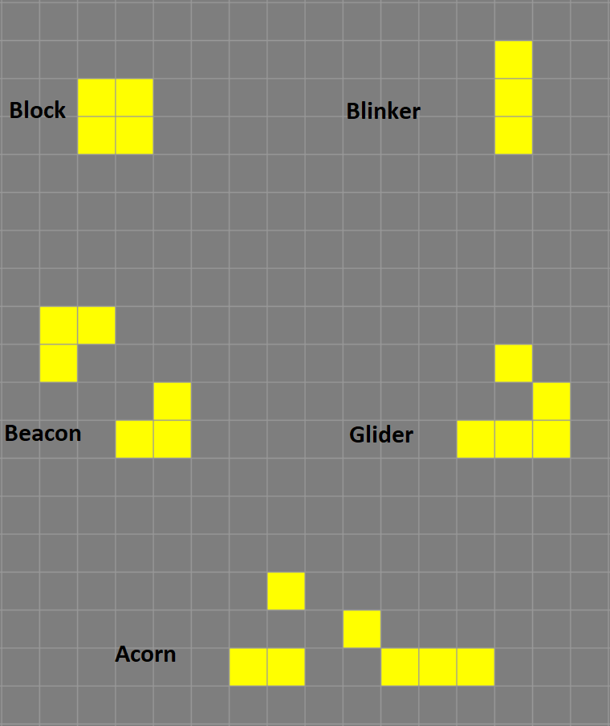

# Introduction

First up this semester is a simulation of Conway’s Game of Life (CGoL).
It will remind us how to work with lists of lists, a very common data
structure, and give us a base for algorithm refinements in the coming
weeks.

Conway's Game of Life occurs on a grid with live and dead cells. Each 
generation simple rules determine whether a each cell survives, dies, 
or is born.

The rules for Conway's Game of Life were described by [Martin Gardner in
Scientific American (1970) Issue 223: pp 120-123](https://www.ibiblio.org/lifepatterns/october1970.html)

"Conways genetic laws are delightfully simple. First note that each cell of 
the checkerboard (assumed to be an infinite plane) has eight neighboring 
cells, four adjacent orthogonally, four adjacent diagonally. The rules are:

1.  Survivals. Every counter with two or three neighboring counters 
    survives for the next generation.
2.  Deaths. Each counter with four or more neighbors dies (is removed) from 
    overpopulation. Every counter with one neighbor or none dies from 
    isolation.
3.  Births. Each empty cell adjacent to exactly three neighbors--no more, 
    no fewer--is a birth cell. A counter is placed on it at the next move."

The amazing thing about these simple rules is that they create seemingly 
complex behaviours. I enocourage you to play with Conway's Game of Life 
to get a better understanding of how it works.

[Game of Life online](https://playgameoflife.com/)

Try each of these classic shapes to see what happens. Note the start 
button will run the generations continuously while the next button will 
only step through one generation.

You can also read more about [Conway's Game of Life](https://en.wikipedia.org/wiki/Conway%27s_Game_of_Life) 
on the Wikipedia page.
