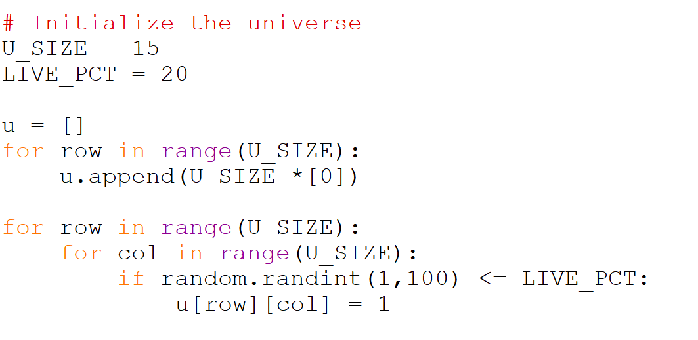

# Create and Initialize the Universe

The first step is to initialize the universe. The universe will be 
represented as a list of lists (an easy way to represent a board). 
This is very similar to the representation we used for tic-tac-toe 
and the Wumpus adjacency matrix. We also need to decide what we will use 
to indicate that a cell at a specific position is either alive or dead. 
One good option would be to use a Boolean operator. This can intuitively 
mapped so that alive cells are `True` and dead cells are `False`. Another 
good option would be to use `0` and `1`. We are going to use this second 
option because later it will be useful when we age the universe and want 
to count the neighbours.

We are going to break creating the universe into two steps.

    Create an empty univers (all 0's)
    Randomly set a subset of the cells to be alive

Here is what that looks like as python code.

Note the `U_SIZE` is the size of the universe. So this code will create 
a 15x15 universe. The `LIVE_PCT` describes the percentage of live cells 
in the universe, so with this value approximately 20% of the cells should 
be alive. Also remember you will have to `import random`.