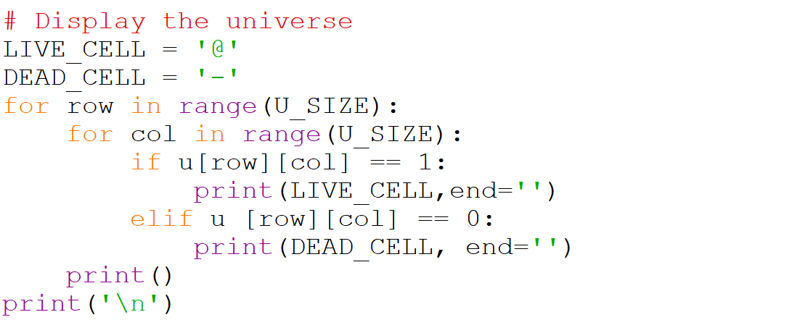

# Display the Universe

Displaying the universe is very similar to displaying a tic-tac-toe 
board. We need to loop through each row and each column and print 
either a live cell or a dead cell. To make the board look a little 
bit more snazzy we are going to represent live cells as the `@` symbol 
and deal cells as the `-` symbol. The global variable `LIVE_CELL` and 
`DEAD_CELL` will make that easy to edit if we decide to use different 
symbols later.

Here is what that looks like as python code.

Remember using `end=''` changes the default behaviour of our `print` 
statement. Normally `print` automatically adds a newline, but we can 
change this so that the separator is an empty string, so that all the 
cells from the same row of our list of lists will correctly print on 
the same row in our display.