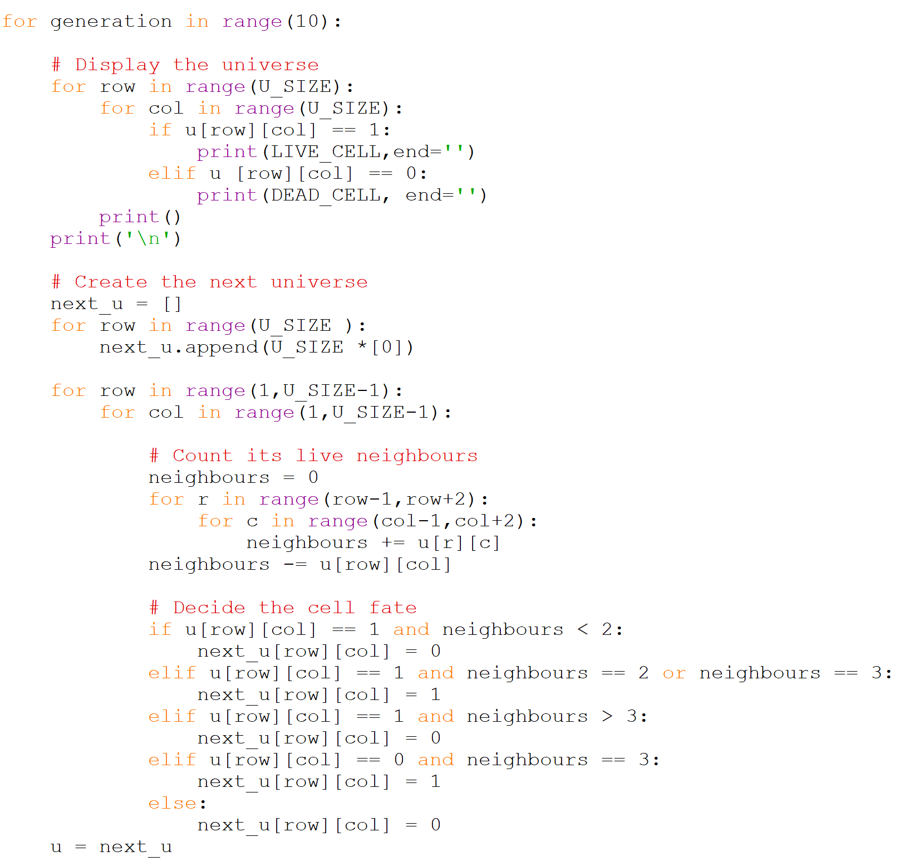
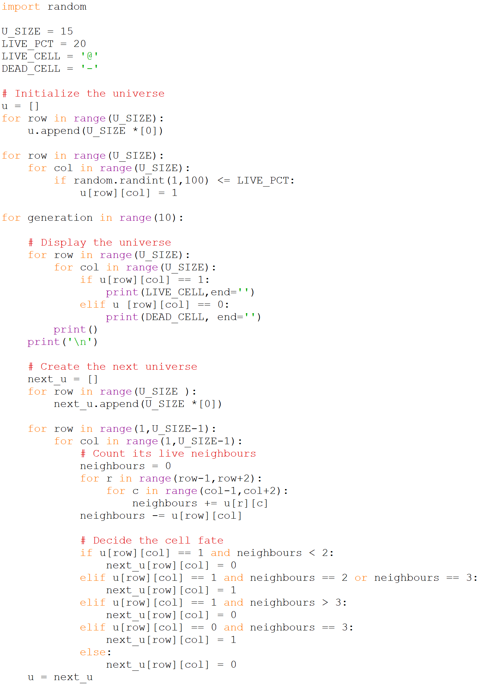

# Age the Universe

The most complicated step in Conway's game of life is aging the 
universe. Recall that the pseudocode broke that into multiple steps.

    Here is the pseudocode describing the main loop of the game. This 
    is similar to the main game loop we used in our Hunt the Wumpus 
    game last semester in that it displays the game state and processes
    a single turn each time through the loop.

        Forever:
            Display the universe
            
            Create an empty next universe
            
            Age the universe:
            Consider every cell in the universe
            Counts its live neighbours
            Based on its current state and its number of live neighbours
                Decide if it lives, dies, or is born
                Record the result in next universe
                
            Replace universe with next universe

The loop starts by displaying the universe and creating a new empty 
'next universe'. Then it goes through each cell and considers each of its 
eight neighbours. Once it has a count of the neighbours it decides based 
on that count (and its current state) whether it is alive or dead in the 
next generation. The final step is to replace the current universe with 
the next universe.

Here is that algorithm in python.

Note that we are not aging the borders of our universe... 
`for row in range(1,U_SIZE-1):` The reason for this is that checking for 
neighbours at the borders is a bit messy. At the beginning of the list 
the index `-1` considers the neighbour to be the end of the list. That is 
because negative numbers are used to index from the end of a list. We get 
an even less desirable behaviour at the end of the list because we end up 
with an index out of range error. It is part of your assignment to 
implement a toroidal universe, where the neighbours wrap to the opposite 
end of the list. This will be easy on one end of the list and more 
complicated at the other.

Here is the code developed so far (as an image, so you’ll need to type it 
in). This is the starting point for Assignment 1.

