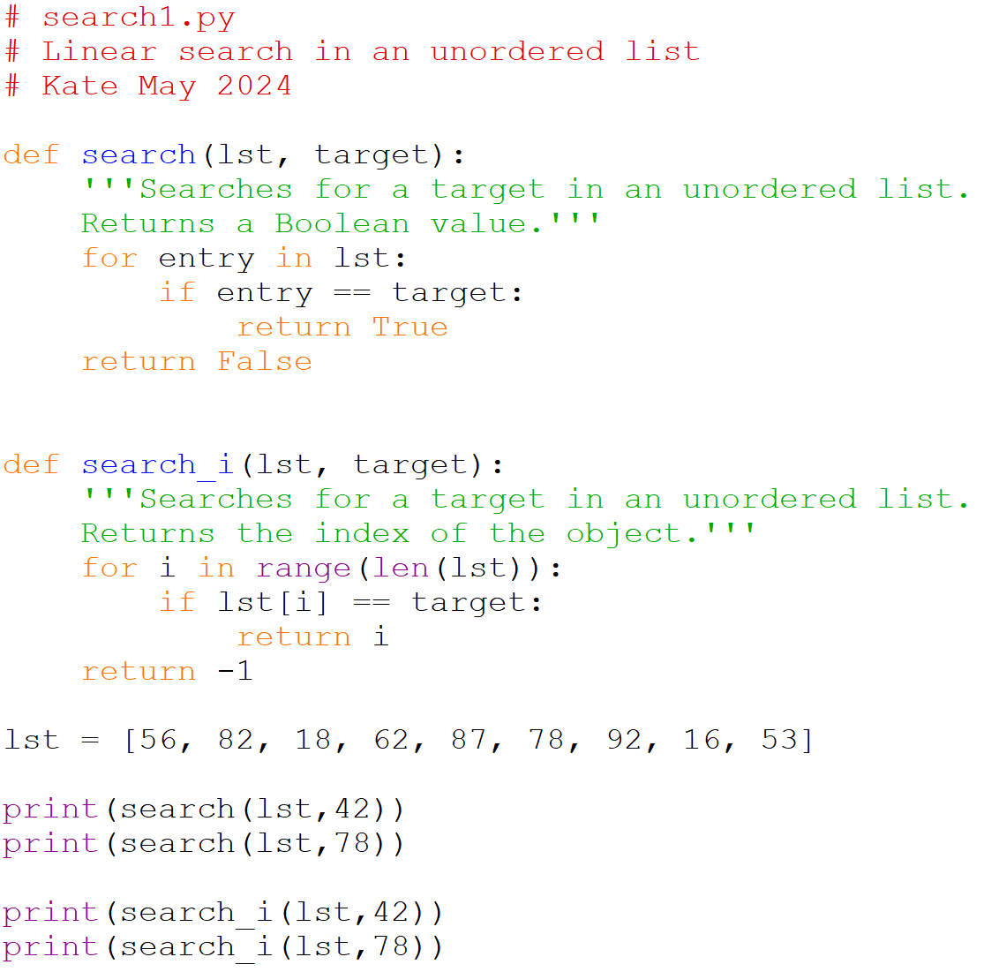

# Linear Search: Unordered list

The first method is a linear search of an unordered list. This the 
simplest to write, but also the least efficient. We don't know anything 
about the list, so our only option is to search through each element in 
the list to see if it matches. If it does match we will want to indicate 
that we found it, or more specifically the index where we found it. Here 
are two functions that implement a linear search of an unordered list. 
For simplicity we will search a list of integers. The function `search` 
returns a Boolean: `True` for present and `False` for absent. The 
function `search_i` returns an integer indicating the index of the 
number in the list (with -1 indicating it was not in the list).

Note that with the algorithm we can only definitively say that we did not 
find the target after we have searched the entire list.