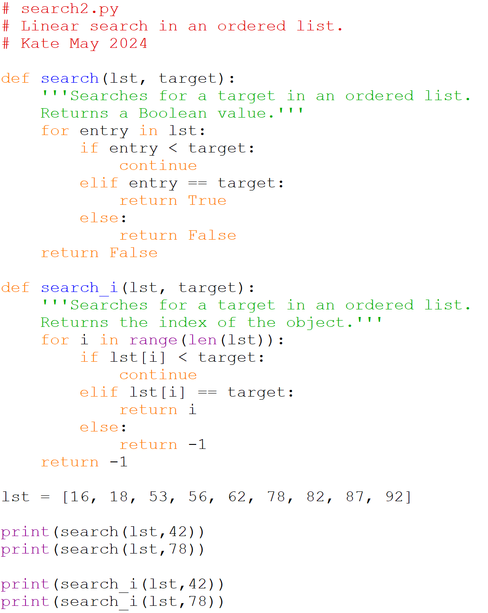

# Linear Search: Ordered list

The second method is a linear search of an ordered list. This is faster 
than the first because it can make use of the fact that the list is sorted. 
We still search through the list from the beginning to the end, but we can 
stop looking once we 'pass' the target. This doesn't save us any time if 
we what we are looking for is the last element of the list, but it does 
let us stop searching sooner in many cases.

In this solution we make use of the python keyword `continue`. This tells 
the program to continue with the next iteration of the loop immediately. 
If there was additional code inside the loop, but after the `if-elif` block, 
it would not run because of the `continue`.