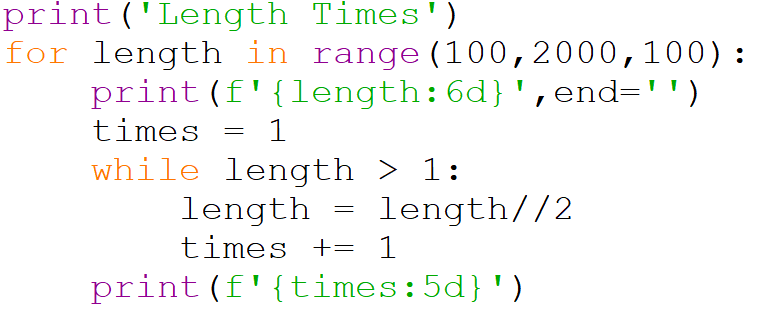
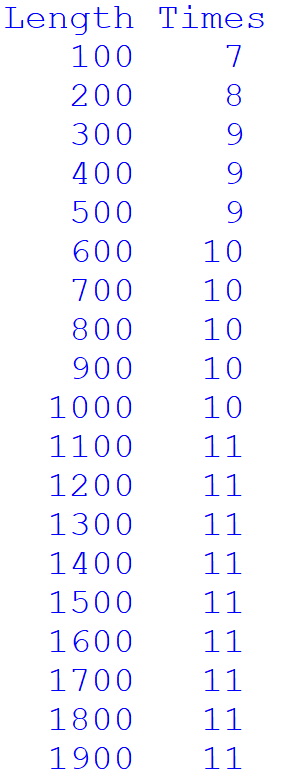
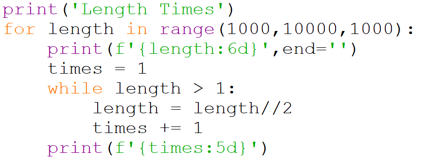
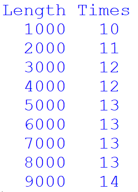

# Binary search

techniques generalize trivially to support any object type that supports

The third method is a binary search of an ordered list. This uses the 
fact that list is sorted, and that we can tell if one value is greater 
than another.

Imagine a game where someone asks you to guess a number between 1 and 
100. After each guess your friend will tell you if you are too high, 
too low, or correct. The best strategy is to make your first guess 50, 
this cuts the number of possible correct answers in half. If the say 
that 50 is too high, then the next guess should be 25. This cuts the 
number of possibilities in half again. If 25 is too low then you could 
guess 37. If that were too low you could guess 43, too high guess 40, 
too low guess 41, and finally if that were too low you would guess 42 
and get the right answer. With only 7 guesses we correctly picked one  
number out of 100. This is the same strategy used by binary search!

    Here is the pseuodocode for a binary search.

        Find the low, high, and middle indices of the list

	While we haven't found the element (and still have indices to search)
            If the target is at the middle index
                Return True we've found it
            Otherwise if the target is greater than the value at the middle index
                Set the high index to the middle index
            Otherwise if the target is smaller than the value at the middle index
                Set the low index to the middle index

            Update the middle index based on the new high and low indexes

        Return False we didn't find it

When we translate this pseudocode to python this is what it looks like.

Remember that `//` performs floor division. So that it will always give 
an integer number (the number of times the whole numerator fits into the 
divisor).

The while loop ends either when we return the value `True` or when lo is 
equal to mid. Unlike our guessing game, sometimes our target will not be 
in the list. When we reach the point where there is nowhere to look 
between lo and mid we know we have exhausted our search and the element 
is not in the list. We look at lo and mid instead of mid and hi because 
we are using floor division (meaning mid is always rounded down).

I've included some more exhaustive tests at the bottom. Notice that 
I've put the tests inside an if statement to make sure the tests are not 
run when the code is imported as a module. The test are designed to look 
for all the values in the list and values that were not included in the 
list. If you run the tests you will notice that the code is not perfect. 
There are some values where it fails in these tests. There is also 
another common case that it fails on that is not included in my tests. 
You will want to fix all of these bugs in the assignment!

We noted in the guessing game that it only took 7 guesses when our 
search space had 100 elements. How well would a binary search work if we 
were looking in longer and longer lists? Below is a bit of code that 
calculates how many guesses are required in the worst case for lists of 
different lengths.

And here is the output of that code.

Notice that it doesn't go up that quickly even as the list gets bigger. 
The number of guesses stays small even when we look at much bigger lists.

And here is the output of that code.

Even when the list is 9000 elements (900x more than our original list) 
the number of guesses is only 14. The number of guesses isn't increasing 
linearly with the length of the list. The number of guesses is actually 
growing logarithmically. We will talk more about the number of 
operations (guesses) required as our list length changes later in the 
module.