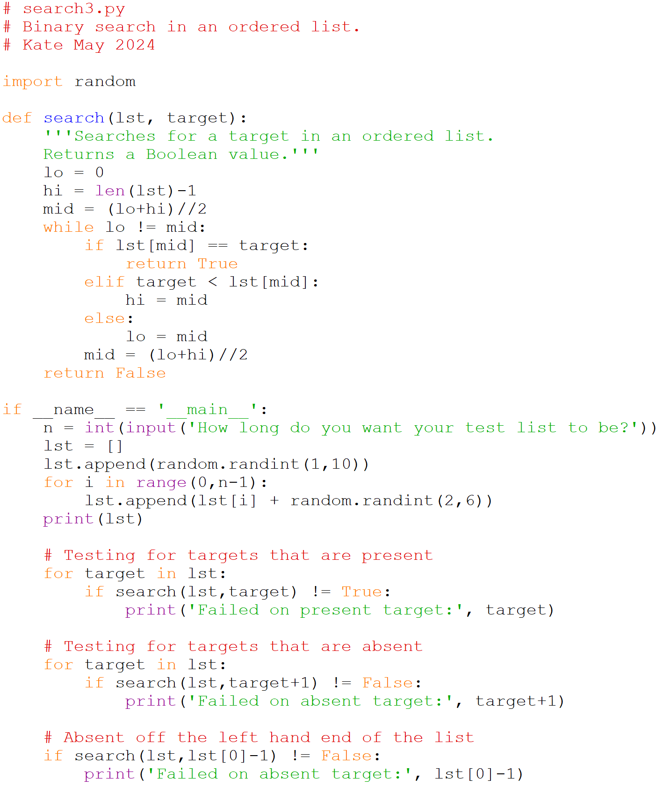

# Interpolative search

The fourth method is an interpolative search of an ordered list. This 
uses the relative magnitude of values to interpolate between them to 
find the likely location of the key.

If we have a list of 100 numbers and we know that the first number in 
the list is one and the last number in the list is 100. If we were 
looking for the number 20 we could guess that our target number is 
probably closer to the front of the list. In fact the most likely 
position is probably 20% of the way through the list. We have 
interpolated the likely location of the number. If we are wrong we can 
see if we are too high or too low and adjust our range and recalculate 
the most likely position of the number based on the new range.

The equation for interpolating the likely position of the target is

The overall algorithm for interpolative search is very similar to 
binary search.

    Here is the pseuodocode for a binary search.

        Find the low, high indices of the list
        Find the interpolated index (make sure you don't divide by 0)

	While we haven't found the element (and still have indices to search)
            If the target is at the interpolated index
                Return True we've found it
            Otherwise if the target is greater than the value at the middle index
                Set the high index to the interpolated index **minus 1**
            Otherwise if the target is smaller than the value at the middle index
                Set the low index to the interpolated index **plus 1**

            Update the interpolated index (make sure you don't divide by 0)

        Return False we didn't find it

There are a couple of differences between binary search and interpolated 
search that we should highlight. The first is that there is the 
possibility that our equation for calculating the position could include 
a division by 0 if the `lst[lo] == lst[hi]`. It is important that you 
handle this case smoothly. Another difference is that we are not setting 
`hi` or `lo` to the interpolated index, but are instead subtracting or 
adding one so that we make sure that we alter our range each time 
through the loop. The final difference will be in when to end the while 
loop. The loop will end when the lo is no longer less than hi and while 
the value of the target is still between the values at indices lo and 
hi. You will complete this search in python as part of assignment 2.