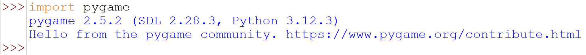

# Getting started with Pygame

You only need to install pygame once. It should already be installed on 
the lab computers.

1.  Open the Command Prompt in Windows (or the terminal on Mac and linux).
    The easiest way to open the Command Prompt is to open the Windows 
    menu and start typing Command Prompt, when it appears as the top 
    option hit enter.

2.  We can now install pygame using the **p**ackage **i**nstaller for 
    **p**ython or **pip** for short. You can do that by typing 
    `pip install pygame` in the terminal window and hitting enter.

3.  You can check that pygame has been properly installed by opening 
    your preferred editor and importing the library with `import pygame`.

This is what my test looked like in IDLE. 

