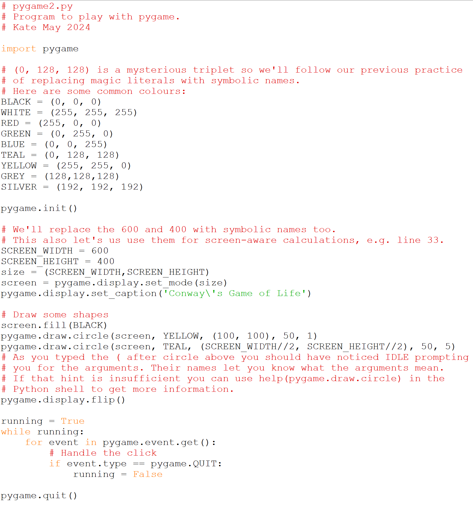
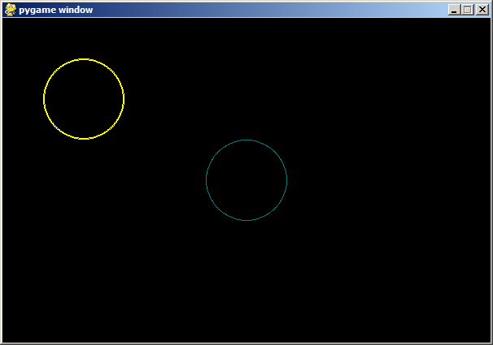

# Drawing something

## Sample output:

## Note

Note that the pygame coordinate system (and most other graphics
libraries too) places the origin in the upper left corner, has an x-axis
that runs horizontally to the right, and a y-axis that runs vertically
downward.

This means that a pygame coordinate (x,y) refers to column x and row y
which is the opposite of the way lists of lists are addressed which is
(row, column) and yes this irritating and leads to bugs, so **be
aware!**
