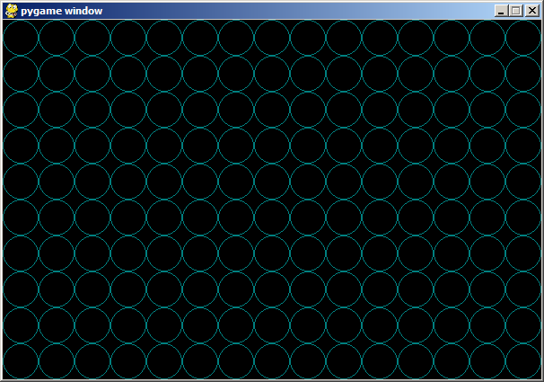

# Drawing lots of a thing

The nice about using a programming language to do your drawing is that
if you want to draw a lot of something you can have the program do it
rather than manually doing a lot of clicking and dragging. (This is the
point of Problem 3 on the assignment).

Be sure to try the change suggested in the comment. Try some others of
your own too.

## Sample output:

{width="606"
height="425"}
