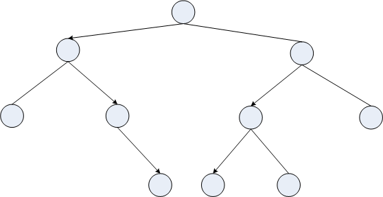

# Recursion: Notes

-   Recursion offers an alternative mechanism for repetition.

-   Alternative to _explicit_ looping constructs like `for` and `while`.

-   The key to desigining a recursive function is to stop thinking about
    writing a function that does the whole job, and to start thinking
    about a function that just,

    a.  knows the next specific step to take to move _toward_ the
        answer, and

    b.  can tell when there’s no point in trying.

-   b. above is the **stopping condition** and without one you may well
    create an infinite loop. See e.g. the first example in
    [Recursion by Example](01_Recursion_by_example.md).

-   Each recursive call starts a new execution of the function code.

-   The state information of the current call (i.e. the values of the
    local variables) is pushed onto a stack (like appending to the end
    of a list).

-   When the called instance terminates, the caller is restarted and its
    local state is popped off the stack to remember “where it was”.

-   If you have started ten instances of a function, then there are 9
    packages of state piled on the stack waiting to be popped off as
    paused invocations are restarted.

-   The recursion call stack is large but not infinite: typically a
    thousand or so entries. You can make it larger (or smaller), but
    shouldn’t generally want to.

-   Recursion can be direct in which a function calls itself, or
    indirect in which one function, say A, calls another, B, which then
    calls A, which calls B, which calls A,...

-   We are seeing recursion now because it simplifies the implementation
    of some algorithms we are about to encounter, i.e. quicksort and
    heapsort.

-   Recursion is most helpful when dealing with recursive data
    structures. For example in a binary tree each part of the tree is
    itself a binary tree.

    {width="558" height="287"}.
