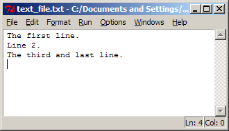

# Reading from text files

Here's how to read data from a text file.

To begin with use IDLE to create a small test text file:



We can visualize this on disk as,

  
```plaintext
T h e   f i r s t   l i n e . \n L i n e   2 . \n T h e   t h i r d   a n d   l a s t   l i n e . \n EOF
```

The only new item here are the `\n` characters These denote newline
characters which like EOF characters vary between operating sytems.
(Don't worry the Python you installed was compiled to know what they
are on your system).

There are three common ways of reading a text file like this in:

1.  One line at a time, processing lines as we go,
2.  The whole file into a string,
3.  The whole file into a list of strings, one entry per line.

When possible, option 1. is preferred since it is the most memory
efficient because it holds only a bit of the file (one line) in memory
at any given time.

Here's the Python code for each of these options.

## One line at a time:

```python
    # file_read_1.py
    f = open('text_file.txt', 'r') # Open the file.
    for line in f:                 # Iterate through the file a line at a time.
        print(line, end="")         # Process the current line.
    f.close()                      # Close the file.
```

or with a while loop...

```python
    # file_read_1.py
    f = open('text_file.txt', 'r') # Open the file.
    line = f.readline()            # Get the first line.
    while line != "":              # Iterate through the file a line at a time.
        print(line, end="")        # Process the current line.
        line = f.readline()
    f.close()                      # Close the file.
```

Notes:

-   The arguments to the `open` function are the name of the file to
    open, and the mode in which to open it. Here the `r` stands
    for **read**.
-   As you can see by the `for` statement, iteration over file
    objects is defined just as it is for lists. The default
    iteration is to grab one line each time.
-   You should always close files when you are finished reading from
    them. The file object will be garbage collected eventually
    anyway and the file closed at that time, but closing ASAP
    reduces memory consumption and allows other processes to access
    the file sooner.

    Output:

```plaintext
>>> 
The first line.
Line 2.
The third and last line.
>>>
```

## The whole file into a string:

```python
    # file_read_2.py
    f = open('text_file.txt', 'r')
    s = f.read()
    print('s is', len(s), 'characters long.')
    print(s)
    f.close()
```

-   The read method of the file object `f` reads the entire file
    including newline characters into memory.

  
```plaintext
>>> 
s is 49 characters long.
The first line.
Line 2.
The third and last line.
>>> 
```

-   Note that the file looks the same as before when displayed
    because the IDLE shell interprets the newline characters
    embedded in it as instructions to start new lines.
-   `read()` can also take an integer argument specifying how many
    bytes to read from the file. Its default behaviour is to read
    all of them.

## The whole file into a list of strings,

```python
    # file_read_3.py
    f = open('text_file.txt', 'r')
    lines = f.readlines()
    print(lines)
    f.close()
```

Output:

```plaintext
>>> 
['The first line.\n', 'Line 2.\n', 'The third and last line.\n']
>>>
```

Note that the newline character is included. If you don't want it
you need to `strip` it yourself.
