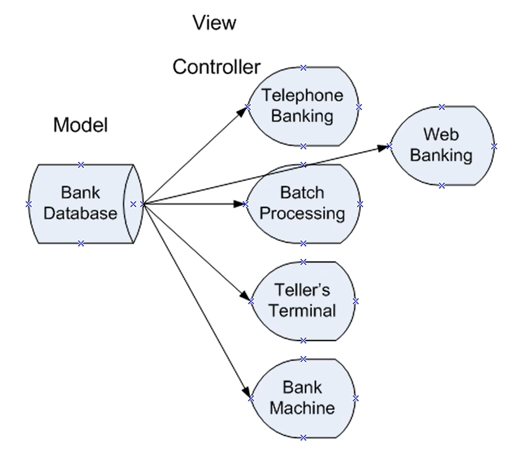
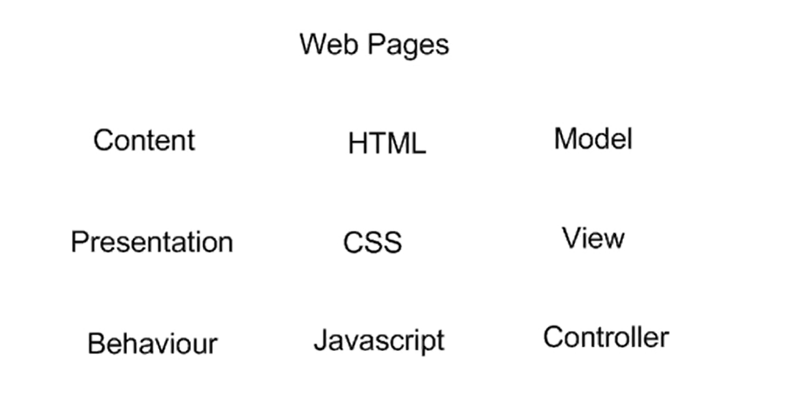
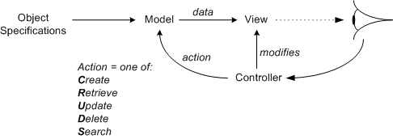

# Introduction

MVC is an acronym for Model, View, and Controller. MVC is an application 
architecture, which means it is a way of structuring an application. 
This is not the same thing as the algorithm, instead it is a way of 
organizing the algorithm. In python this is typically done with modules. 
MVC architecture lets programmers separate their code into distinct 
components that can be edited independently.

MVC architecture is so useful that it has been independently discovered 
multiple times. One classic example of MVC arcitecture is in databases. 
Databases tend to be long lived (university records, medical records, 
library catalogues). YTG has databases that are over 50 years old that 
they still need to access today. How they access that data will have 
changed a lot in 50 years. In that time the database may not have 
changed significantly, but the way we interact with it has.

Let's consider and example with a bank database. The database holds the 
financial information for all the bank clients. Originally, the only way 
to interact with the database would have been through batch processing 
where one technically savy individual would process all the 
transactions. There was only this one way to access the database. Later 
terminals could be used by tellers (and other bank employees) to process 
transactions. Later bank machines were added so that individuals could 
do there own banking. Telephone banking was briefly possible through 
touch-tone phones. Now we can bank online with our computers or phones. 
In this example the database is our model, and it may not have changed. 
However, the view and controller has changed multiple times. The view 
and the controller are often bundled (the display and the 
keyboard/mouse). The view is what let's the user see the model and the 
controller is what let's the user interact with the model. In addition 
to being able to edit the view and the controller without changing the 
model, we can also do the converse where we edit the model without 
changes to the view or controller. A bank could overall its database 
without changing the web interface that we use.

Another classic example of MVC is webpage design. Wepages are often 
programmed using three different programming languages HTML (for 
content), CSS (for presentation), and Javascript (for behaviour). 
This could also be decribed as a model, view, and controller.

To see how powerful this can be check out the [CSS Zen Garden](https://csszengarden.com/pages/alldesigns/) 
to see how the same HTML can be displayed very differently just by 
changing the CSS code associated with the presentation (or view).

MVC architecture has many of the same strengths as object-oriented 
programming. In object-oriented programming changes to the system are 
localized, simplifying the changes and ensuring that they don't break 
the rest of the code.

# Review

The model is where the content or data is represented.
The view is how the content/data is displayed.
The controller is how the content/data is edited.

In software the view and controller are often integrated. They are 
sometimes separated in physical systems, for example a tv where the is 
responsible for the view and the remote is responsible for the 
controller.