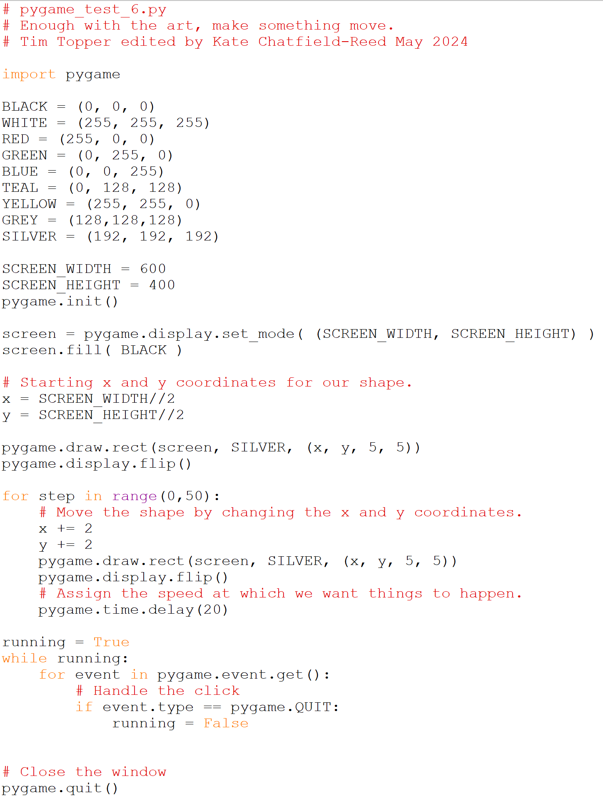

# Making something move 1

Animation is all a trick that relies on the low frame rate of the human
visual system. That is, if something changes fast enough and in small
enough increments we don’t notice the jumps from one image to the next.
This is how the frame rate of movie projectors evolved---they kept
speeding it up until it didn’t look jumpy”---which lives on in the
refresh rates of modern tv’s and monitors.

Here we take our first step and move a shape down and across the screen.

## Sample output:

