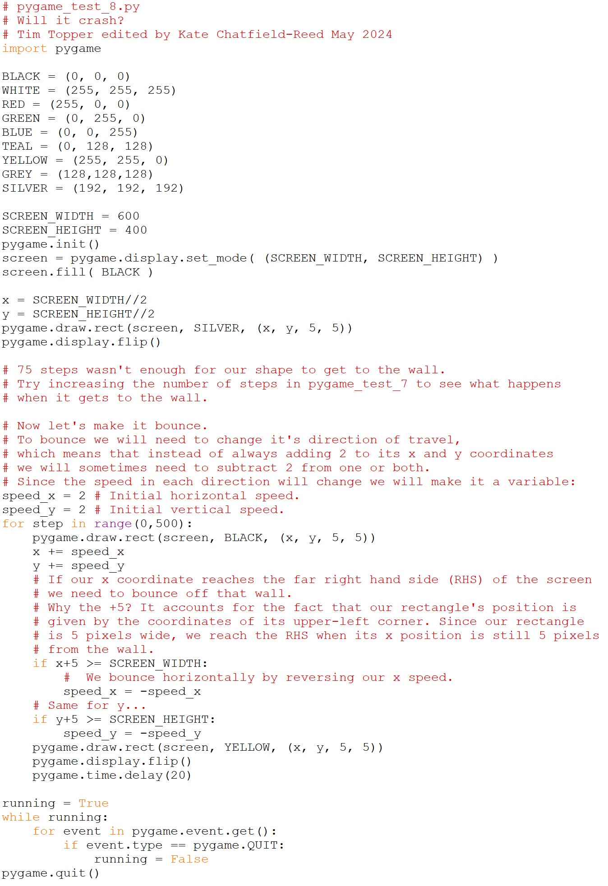

# Making something move 3

What will happen when it gets to the wall, i.e. the edge of the screen?

**Wrong question**! What will happen is **whatever we decide should
happen**. The window is our Universe and we are its designers. We get to
decide what will happen. Let’s make it seem to bounce off the edge.

## Sample output:

