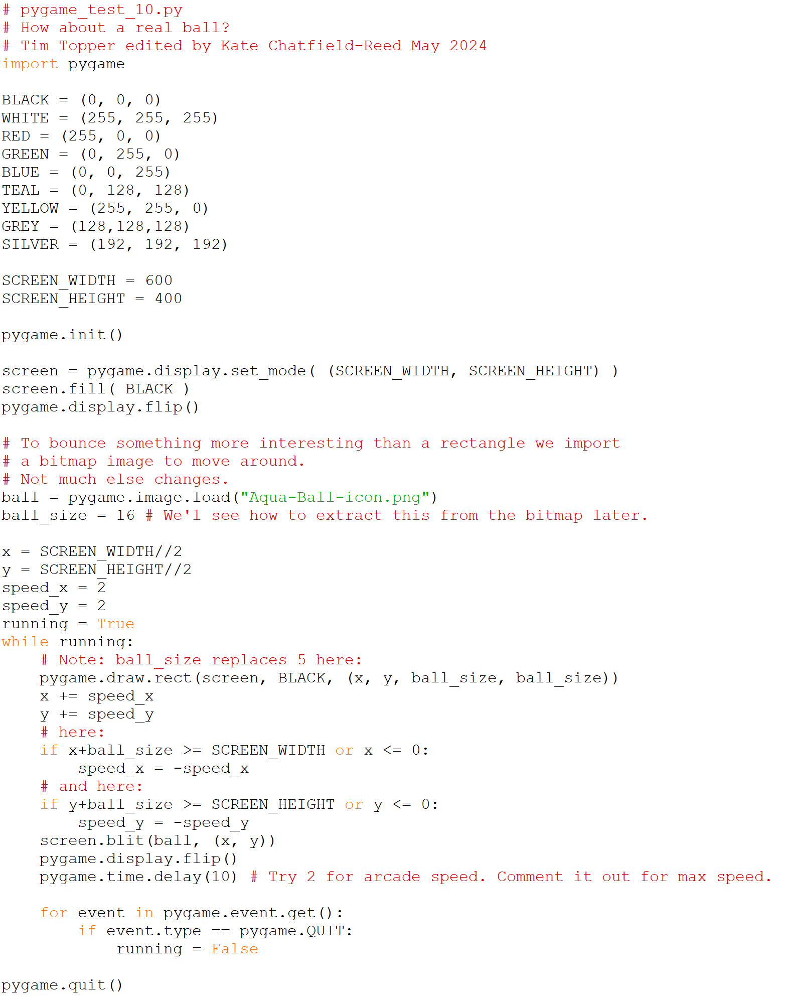

# Making something move 5

Finally, let’s make something more interesting bounce.

## Sample output:

<video controls width="100%">
    <source src="../06_pygame_test_10.py.output.mp4" type="video/mp4">
    Sorry, your browser doesn't support embedded videos.
</video>

Playback speed:
    <button onclick="OneX()">1.0x</button>
    <button onclick="OnePointFiveX()">1.5x</button>
    <button onclick="TwoX()">2.0x</button>

