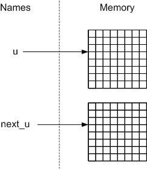
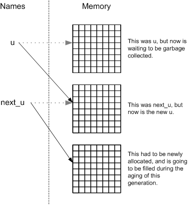

# The New Aging Scheme

Here’s a diagram showing the four arrays we will now be working with
and showing how they change over the course of one generation for a
simple blinker.

<table border="0">
  <col />
  <col />
  <col />
  <col />
  <col />
  <col />
  <col />
  <col />
  <col />
  <col />
  <col />
  <col />
  <col />
  <col />
  <col />
  <col />
  <col />
  <tbody>
    <tr>
      <td colspan="5"
        style="text-align:center; width: 150px;"><strong>u</strong></td>
      <td style="width: 50px;"></td>
      <td colspan="5"
        style="text-align:center; width: 150px;"><strong>next_u</strong> (at
        start)</td>
      <td style="width: 50px;"></td>
      <td colspan="5"
        style="text-align:center; width: 150px;"><strong>next_u</strong> (at
        end)</td>
    </tr>
    <tr>
      <td>0</td>
      <td>0</td>
      <td>0</td>
      <td>0</td>
      <td>0</td>
      <td></td>
      <td>0</td>
      <td>0</td>
      <td>0</td>
      <td>0</td>
      <td>0</td>
      <td></td>
      <td>0</td>
      <td>0</td>
      <td>0</td>
      <td>0</td>
      <td>0</td>
    </tr>
    <tr>
      <td>0</td>
      <td>0</td>
      <td>1</td>
      <td>0</td>
      <td>0</td>
      <td></td>
      <td>0</td>
      <td>0</td>
      <td>1</td>
      <td>0</td>
      <td>0</td>
      <td></td>
      <td>0</td>
      <td>0</td>
      <td>0</td>
      <td>0</td>
      <td>0</td>
    </tr>
    <tr>
      <td>0</td>
      <td>0</td>
      <td>1</td>
      <td>0</td>
      <td>0</td>
      <td></td>
      <td>0</td>
      <td>0</td>
      <td>1</td>
      <td>0</td>
      <td>0</td>
      <td style="text-align: center;">&rarr;</td>
      <td>0</td>
      <td>1</td>
      <td>1</td>
      <td>1</td>
      <td>0</td>
    </tr>
    <tr>
      <td>0</td>
      <td>0</td>
      <td>1</td>
      <td>0</td>
      <td>0</td>
      <td></td>
      <td>0</td>
      <td>0</td>
      <td>1</td>
      <td>0</td>
      <td>0</td>
      <td></td>
      <td>0</td>
      <td>0</td>
      <td>0</td>
      <td>0</td>
      <td>0</td>
    </tr>
    <tr>
      <td>0</td>
      <td>0</td>
      <td>0</td>
      <td>0</td>
      <td>0</td>
      <td></td>
      <td>0</td>
      <td>0</td>
      <td>0</td>
      <td>0</td>
      <td>0</td>
      <td></td>
      <td>0</td>
      <td>0</td>
      <td>0</td>
      <td>0</td>
      <td>0</td>
    </tr>
    <tr>
      <td></td>
      <td></td>
      <td></td>
      <td></td>
      <td></td>
      <td></td>
      <td></td>
      <td></td>
      <td></td>
      <td></td>
      <td></td>
      <td></td>
      <td></td>
      <td></td>
      <td></td>
      <td></td>
      <td></td>
    </tr>
    <tr>
      <td colspan="5" style="text-align:center;"><strong>n</strong></td>
      <td></td>
      <td colspan="5" style="text-align:center;"><strong>next_n</strong> (at
        start)</td>
      <td></td>
      <td colspan="5" style="text-align:center;"><strong>next_n</strong> (at
        end)</td>
    </tr>
    <tr>
      <td>0</td>
      <td>1</td>
      <td>1</td>
      <td>1</td>
      <td>0</td>
      <td></td>
      <td>0</td>
      <td>1</td>
      <td>1</td>
      <td>1</td>
      <td>0</td>
      <td></td>
      <td>0</td>
      <td>0</td>
      <td>0</td>
      <td>0</td>
      <td>0</td>
    </tr>
    <tr>
      <td>0</td>
      <td>2</td>
      <td>1</td>
      <td>2</td>
      <td>0</td>
      <td></td>
      <td>0</td>
      <td>2</td>
      <td>1</td>
      <td>2</td>
      <td>0</td>
      <td></td>
      <td>1</td>
      <td>2</td>
      <td>3</td>
      <td>2</td>
      <td>1</td>
    </tr>
    <tr>
      <td>0</td>
      <td>3</td>
      <td>2</td>
      <td>3</td>
      <td>0</td>
      <td></td>
      <td>0</td>
      <td>3</td>
      <td>2</td>
      <td>3</td>
      <td>0</td>
      <td style="text-align: center;">&rarr;</td>
      <td>1</td>
      <td>1</td>
      <td>2</td>
      <td>1</td>
      <td>1</td>
    </tr>
    <tr>
      <td>0</td>
      <td>2</td>
      <td>1</td>
      <td>2</td>
      <td>0</td>
      <td></td>
      <td>0</td>
      <td>2</td>
      <td>1</td>
      <td>2</td>
      <td>0</td>
      <td></td>
      <td>1</td>
      <td>2</td>
      <td>3</td>
      <td>2</td>
      <td>1</td>
    </tr>
    <tr>
      <td>0</td>
      <td>1</td>
      <td>1</td>
      <td>1</td>
      <td>0</td>
      <td></td>
      <td>0</td>
      <td>1</td>
      <td>1</td>
      <td>1</td>
      <td>0</td>
      <td></td>
      <td>0</td>
      <td>0</td>
      <td>0</td>
      <td>0</td>
      <td>0</td>
    </tr>
  </tbody>
</table>

Note well that `u` and `n` do not change over the course of a
generation, and that all changes are reflected in `next_u` and `next_n`.
These changes carry into the next generation because we copy `next_u`
into `u`, and `next_n` into `n` between generations.

This also helps clarify the aging logic (or it did in my mind) because
it reminds us that it is _cell changes_ we care about. This in turn
suggests that we begin each generation with exact copies of our current
universe and neighbour arrays and then record the changes in one of
them. At the end of the generation we again make exact copies of them.
We’ll see if this is any slower than allocating new universes and
waiting for garbage collection to clean up the old ones as we do
now[^*].

The framework to make all this happen looks like this,

```python
    # Construct initial neighbours array n by looping over whole universe and counting neighbours.
    # This is just like the original doubly nested loop we used to have to count neighbours in the aging block.
     ...

    for ... # main loop
        # Copy next_u into u and next_n into n.
        for row in range(0, u_rows):
            for col in range(0, u_cols):    
                u[row][col] = next_u[row][col]
                n[row][col] = next_n[row][col]

        # Age the universe:
        # Consider every cell in the universe
        for row in range(0, u_rows):
            for col in range(0, u_cols):    

                if u[row][col] == 1 and (n[row][col] < 2 or n[row][col] > 3):
                    next_u[row][col] = 0
                    # Update next_n to reflect this death by subtracting 1 from the neighbour
                    # count of each of this cell's eight neighbours.
                    # (While remembering that it's a toroidal universe!)
                    ...
                    
                elif u[row][col] == 0 and n[row][col] == 3:
                    next_u[row][col] = 1
                    # Update next_n to reflect this birth by adding 1 to the neighbour
                    # count of each of this cell's eight neighbours.
                    # (And remembering that it's a toroidal universe!)
                    ...
        
        # display(u)
```

------------------------------------------------------------------------

[^*] Didn’t realize this is what we were doing? During the aging loop
we had this,

{width="243" height="279"}

And afterward (at the start of the next aging loop) we had this,

{width="379" height="410"}
