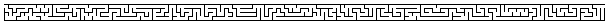

# Approaches

Not surprisingly there’s more than one approach...

1.  Here’s one:

    The algorithm starts by dividing the area into an array of
    rectangular cells, each with 4 walls. Each cell is given a region
    identifier. Then, at random, we find two cells in different
    regions, remove the intervening wall and combine the two regions
    into 1. We repeat this (width x height - 1) times. Now there is
    only one region which contains all the cells. This guarantees that
    there is a route from any cell to any other cell. Also, because
    we’ve removed the smallest number of walls to achieve this state
    there will only be one direct route (ie. one that doesn’t involve
    retracing your steps).

2.  And here’s a lightly edited version of a maze carving approach from
    Robert Scott Ladd.

    Generate a new maze with all walls standing. The maze carving
    algorithm begins by selecting an entrance” cell, opening the
    outside wall, and then following this algorithm: Pick a random
    direction, and move to the adjoining cell in that direction, if
    you haven’t visited it before. Add the previous cell location to
    the list of visited cells. Knock out the wall between the cell you
    came from and the one you’re in, then move to another
    randomly-selected adjacent cell. Repeat the process until you
    reach a place that is surrounded by cells that have all already
    been visited. At this point, work your way back through the list
    of visited cells until you find one that does have an unvisited
    neighbor, and start carving again. The result is a maze with a
    long twisty solution and lots of long dead ends.

3.  And yet another from SlickCow:

    To draw a maze, first create some kind of outer shell with two
    holes--one that will function as a start and another as a finish.
    This shell determines the overall shape of your maze, so make it
    something interesting to look at.
    
    To add complexity, you have to draw internal lines, following one
    simple rule: any and every line you draw must be connected to some
    other line at one of its ends. That is, you should draw lines that
    branch out from a line that was already drawn.
    
    This forces your first line to be connected to some part of your
    outer shell, but your second line could be connected to either the
    shell or the first line. Your third line could be connected to
    either the shell, first, or second line...
    
    Go ahead and go crazy drawing lines. The more lines there are, the
    harder the maze becomes. A very fine tipped pencil or pen will
    allow for extremely complex mazes. It helps to leave the open end
    of lines at places people are likely to come to traversing the
    maze. This forces them to make a decision between at least two
    corridors... one is correct, the others must be wrong.
    
    Using this one rule, there will always be one and only one pathway
    from the start to the finish. Any line you draw without
    connections to other lines will not affect the navigation through
    the maze, but it could add certain aesthetic qualities. Any line
    you draw that has two connections presents an opportunity to block
    off the correct pathway from start to finish. It is something to
    be avoided.[*](http://everything2.com/index.pl?node_id=606941)

