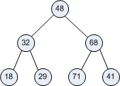

# Representing a tree using a list

When _Sorting Out Sorting_ got to Heapsort your first thought on seeing
the tree might be What is that thing?!”

Computer scientists call them trees --- even though they look more like
root systems than tree branches! We apologize, but it’s all because we
used to draw them on paper working down the page so as they grew we
would add branches” downward in the direction we were used to
writing. There is some jargon used to describe their parts:

-   the circles are called _nodes_,
-   the lines are called _branches_,
-   the node at the top is called the _root_,
-   and the nodes along the bottom are called _leaves_.

You can also see that computer scientists don’t worry about mixing
metaphors.

-   the node directly above another one is its _parent_ (like in a
    family tree),
-   the nodes directly below a node are its _children_.

(There are in fact many types of trees used in Computer Science. This is
a _balanced_ _binary_ tree. _Binary_ because each node has at most two
children, and _balanced_ because it’s all filled in”, or more
formally because all paths from root to leaf have the same length.)

Your second thought as you watched the tree operations in the video
might be to wonder how on earth you’d write code to work with it.
We’ve worked with lists and strings and tuples and dictionaries, but
none of them look like a tree, and at first glance none of them seem to
be good candidates to represent something like a tree.

To see how we can do it let’s look our list and tree together and see
how we might map one onto the other.

`lst = [ 48, 32, 68, 18, 29, 71, 41 ]`

Working with the tree” means being able to follow the branches to get
from node to node. Notice that at any instant at most three movements
are possible:

-   From a node down to its left child
-   From a node down to its right child
-   From a node up to its parent

To see how we might do that in the list let me draw arrows on the list
to show how the values are linked in the tree:

Since list operations work with the list indices let me replace the list
values with their corresponding indices.

And now let’s look for patterns! How about from nodes to their left
children?

| parent node index | 0 | 1 | 2 |
|-------------------|---|---|---|
| left child index  | 1 | 3 | 5 |

Perhaps you can see the relationship here? The index of a left child is
twice the index of its parent plus one. Or in Python,

    def left_child(node):
        return 2*node + 1

Now, how about from nodes to their right children?

| parent node index | 0 | 1 | 2 |
|-------------------|---|---|---|
| right child index | 2 | 4 | 6 |

Most students find this one less obvious, from 0 to 2 looks like we add
two, from 1 to 4 looks like we multiply by four and from 2 to 6 looks
like we multiply by three. No good pattern there. So look at it another
way: we can see in the diagram above that the right child always comes
right after the left child in the list, so its index will be exactly one
greater, i.e. its index will be `(2*node + 1) `**`+ 1`**, which is
`2*node + 1 + 1` or `2*node + 2`. Or in Python,

    def right_child(node):
        return 2*node + 2

And finally child to parent:

| child node index | 0 | 1 | 2 | 3 | 4 | 5 | 6 |
|------------------|---|---|---|---|---|---|---|
| parent index     | - | 0 | 0 | 1 | 1 | 2 | 2 |

This is almost a divide by two pattern which makes sense: since we got
from parents to children by multiplying by two and adding, we should be
able to get back by subtracting and then dividing by two:

    def parent(node):
        return (node-1)//2

These three functions, `left_child`, `right_child` and `parent` will let
us move through a list as though it were a heap. Most often we move
forward through a list by incrementing an index by 1 and backward by
decrementing it by 1. These functions calculate how far to move based on
where we are to simulate the movement though a tree. Using them we will
seem to bounce around the list by jumping back and forth, but the jumps
aren’t random they are carefully calibrated to replicate moving through
a tree. So we can represent a Heap in a list just by modifying how we
move through the list.
