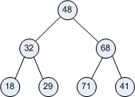
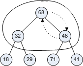
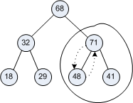
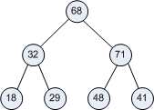

# Heapsort

Start by watching the portion of 
[_Sorting Out Sorting_](https://youtu.be/gtdfW3TbeYY?t=70) that covers 
Heapsort again. At first Heapsort may look like some manic game of
musical chairs with values dancing around a tree”. But if you watch
carefully (or perhaps enough times!), a general pattern should become
apparent: create a heap, move a value, reheap.

First we convert the whole tree to a heap. Then we move the top item in
the tree to the current last position in the list. Now moving that last
value into the root position of the tree will usually unheapify the
tree, so we reheapify it (but not including that last item). We repeat
this as many times as there are items in the tree.

Written out in pseudocode format instead of English we get something
like this,

    heapify the tree
    As many times as there are elements in the list:
        swap the root element with the last element
        reheapify the tree (except for last item)

There are some clarifications needed:

-   The first is that last changes, it reduces by one on each iteration.
    It starts out as the last position in the list and then moves
    forward one position on each iteration (in the video this
    corresponds to moving across the tree from right to left and then up
    a level as necessary).

-   The second is that heapify and reheapify are not identical
    processes. If you watch the video again you will see that the
    initial heapifying is bottom up. It starts with the bottommost
    subtrees of 3 elements and then works its way upward. Reheapifying
    can start at the top and then work its way down one path in the
    tree, because the root-last swap that was done can be fixed by
    rejigging just one path from the root to a leaf.

Taking these changes into account produces a refined version:

    heapify the tree
    set last to len(lst) - 1
    while last > 0:
        swap the root with last
        reheap the tree stopping before last

So what exactly do we do when we reheap starting at a particular
location? We check that value against its children and make sure it is
larger than them. If it is, we are done. If it isn’t we swap it with
the largest of its children and then call reheap on the subtree that
starts at that child (so it is a recursive procedure), e.g. if we begin
with this,



we heap the top subtree to get this,



and then call reheap on the lower right subtree,



to get this final subtree,



Reheaping then works like this,

    compare root (of subtree) with both children
    if root is larger than both children stop
    elif the left child is largest
        swap root and left child
        call reheap on left child subtree
    elif the right child is largest
        swap root and right child
        call reheap on right child subtree

or translated into something Pythonish after rearranging the tests so as
not to bother starting with a do nothing branch,

``` python
def reheap(lst, node):
    lc = left_child(node)
    rc = right_child(node)
    if lst[lc] > lst[node] and lst[lc] > lst[rc]:
        (lst[lc], lst[node]) = (lst[node], lst[lc])
        reheap(lst, lc)
    elif lst[rc] > lst[node]:
        (lst[rc], lst[node]) = (lst[node], lst[rc])
        reheap(lst, rc)
```

Running this reveals that it doesn’t know when to stop reheaping and
falls off the bottom of the tree heading downward (because we forgot to
provide a stopping condition for the recursive calls). We fix this by
adding a stopping point to get,

``` python
# reheap.py

def left_child( node ):
    return 2*node + 1
def right_child( node ):
    return 2*node + 2

def reheap(lst, node, stop):
    lc = left_child(node)
    rc = right_child(node)
    if lc >= stop:
        return
    if lst[lc] > lst[node] and lst[lc] >lst[rc]:
        (lst[lc], lst[node]) = (lst[node], lst[lc])
        reheap(lst, lc, stop)
    elif lst[rc] > lst[node]:
        (lst[rc], lst[node]) = (lst[node], lst[rc])
        reheap(lst, rc, stop)

lst = [48, 32, 68, 18, 29, 71, 41]
print('Before:', lst)
reheap(lst, 0, len(lst)-1)
print('After:', lst)
```

This works on a full tree, but it does assume that nodes always have
both children which will not always be the case.

With reheap in place we can further refine our earlier pseudocode,

``` python
heapify the tree
for last in range(len(lst)-1, -1, -1):
    (lst[0], lst[last]) = (lst[last], lst[0])
    reheap(lst, 0, last)
```

Which just leaves the puzzle of what heapify the tree” means. In
retrospect, with the experience we have gained writing reheap, it’s not
hard to see that heapify just consists of calling reheap on all subtrees
of the list from _the bottom up_,

```python
# heapify.py

def parent(node):
    return (node-1)//2

def heapify(lst):
    for node in range(parent(len(lst)-1), -1, -1):
        reheap(lst, node, len(lst)-1)

lst = [48, 32, 68, 18, 29, 71, 41]
print('Before:', lst)
heapify(lst)
print('After:', lst)
```

Now we just need to combine these to get a working Python heapsort:

``` python
# heapsort.py

def left_child( node ):
    return 2*node + 1

def right_child( node ):
    return 2*node + 2

def parent(node):
    return (node-1)//2


def reheap(lst, node, stop):
    lc = left_child(node)
    rc = right_child(node)
    if lc >= stop:
        return
    if lst[lc] > lst[node] and lst[lc] > lst[rc]:
        (lst[lc], lst[node]) = (lst[node], lst[lc])
        reheap(lst, lc, stop)
    elif lst[rc] > lst[node]:
        (lst[rc], lst[node]) = (lst[node], lst[rc])
        reheap(lst, rc, stop)

def heapify(lst):
    for node in range(parent(len(lst)-1), -1, -1):
        reheap(lst, node, len(lst)-1)

def heapsort(lst):
    heapify(lst)
    print('Heaped:', lst)
    for last in range(len(lst)-1, -1, -1):
        (lst[0], lst[last]) = (lst[last], lst[0])
        reheap(lst, 0, last-1)
        print(lst)
        
lst = [48, 32, 68, 18, 29, 71, 41]
print('Before:', lst)
heapsort(lst)
print('After:', lst)
```

Which works on many but not all lists. Problem 2 on the assignment is to
tweak it so it works on all lists.
