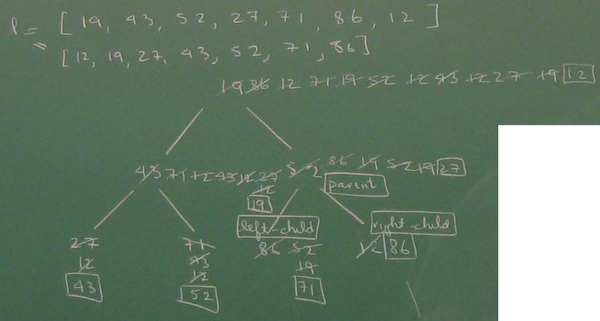
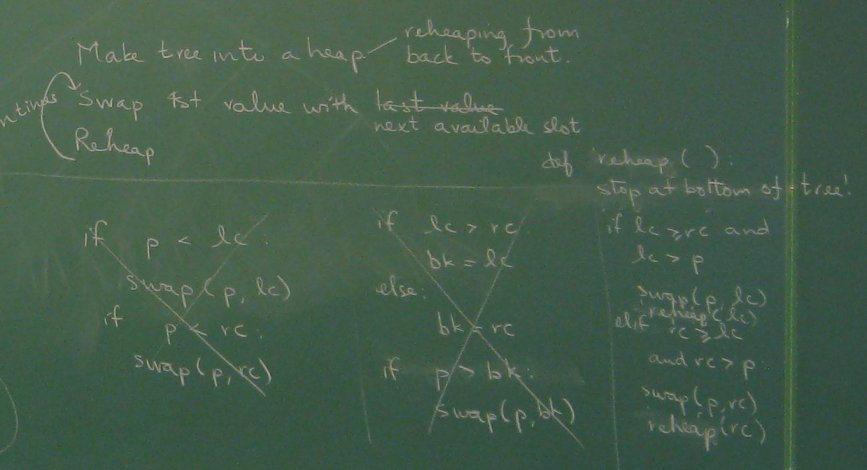
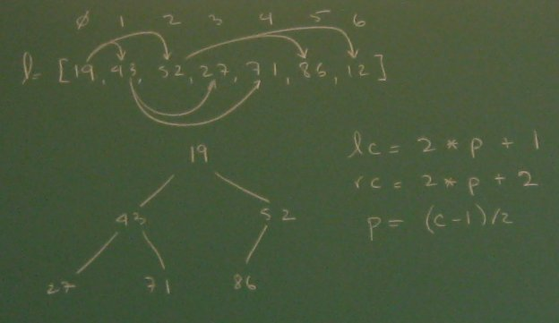

# Heapsort

First we review the heapsort algorithm by doing it by hand for a small
tree.

Then we work on pseudocode to express our understanding of the
algorithm. Note the three tries it took on paper” just to get the
swapping done right.

To express it in Python we will need to figure out how to store our heap
(binary tree) in a list, and replace our uses of lc and rc with
calculations.

