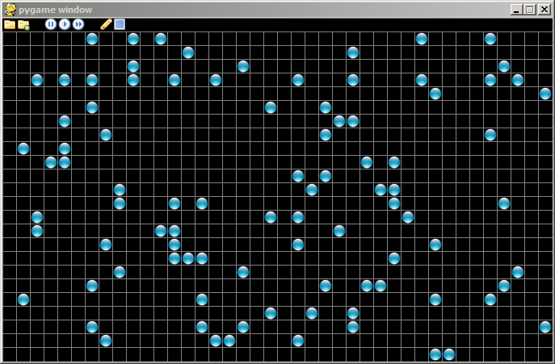

# The Goal

Our game of life program has a graphical display now that looks more
polished than the terminal output we began with, but graphical output
deserves a graphical interface. Something like this,

{width="687" height="451"}

The interface isn’t huge, but you will notice a small row of icons in
the upper left corner that can be used to control the execution of the
game.

{width="16" height="16"}

:   Allows one to load a saved configuration of the universe.

{width="16" height="16"}

:   Save the current universe to a file.

{width="16" height="16"}

:   Pause the simulation.

{width="16" height="16"}

:   Advance one generation.

{width="16" height="16"}

:   Simulate continuously.

{width="16" height="16"}

:   Edit the universe, i.e. clicking the mouse will toggle the state of
    the cell beneath the cursor.

{width="16" height="16"}

:   Clear the universe.
