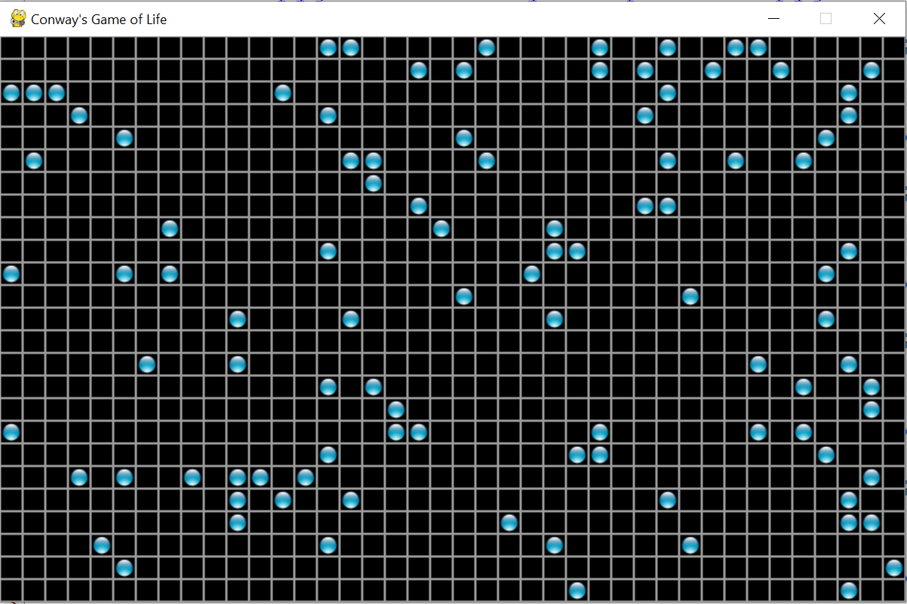

# Step 1: Make a plan

In a previous module we made a beautiful graphic to display Conway's 
Game of Life (like the one shown below). A good graphic deserves a good 
graphical user interface.

The new version will have icons at the top that let us perform different 
actions in our game. Here are the steps we will need to take to make the
changes:

- Review code.

- Make room to display the menu of icons (without breaking our display).

- Display icons.

- React to mouse clicks on icons:

    - Detect the mouse click.

    - Get mouse location.

    - Map from coordinates to icon.

    - Take matching action (invoke function).

We are going to work through this list to make our fanciest Game of Life 
yet!