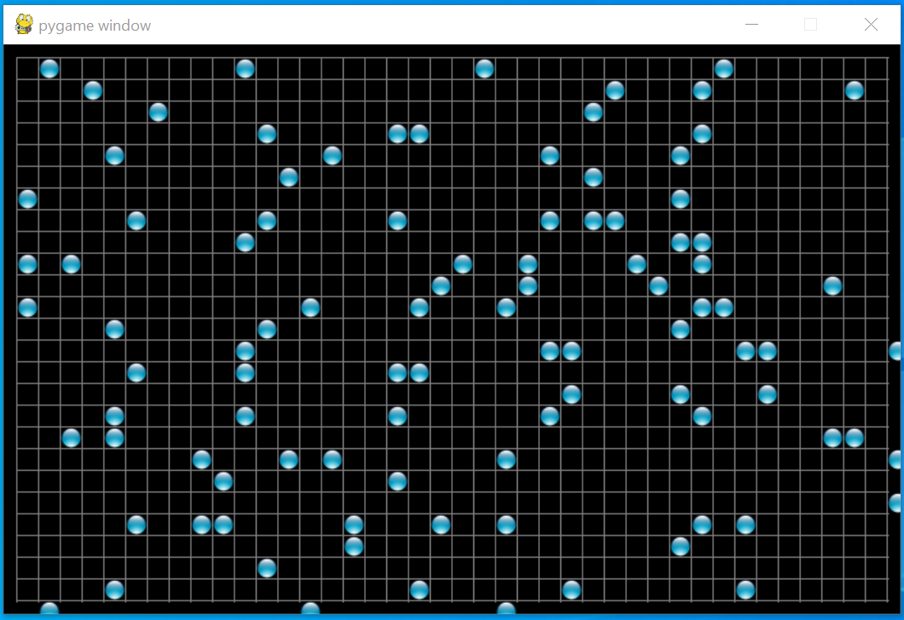
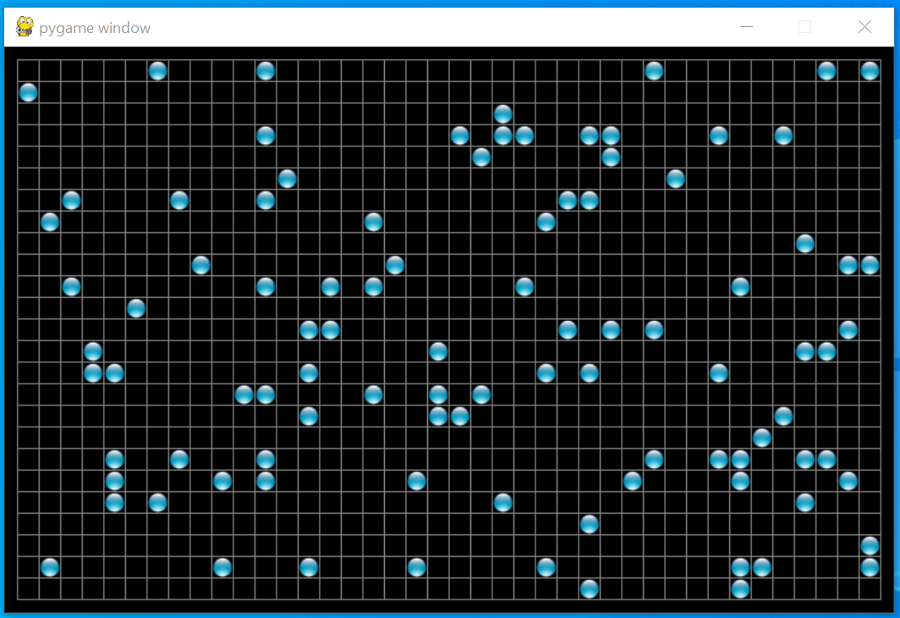

# Step 3: Test existing code

The first thing we're going to do it add an outside border to our 
universe. This will be a good intermediate step make sure we are getting 
all of the boundaries in the right place. The addition of a border is 
going to change all of our coordinates, if the border was 10 pixels we 
would want to start drawing at (10,10) instead of (0,0). Instead of 
hardcoding the value 10, we will create a new constant `BORDER_WIDTH`. 
This will have a number of effects, starting with some changes to our 
screen size.

```python
BORDER_WIDTH = 10

# we have to add 2x the border to the height account for the top and bottom borders
SCREEN_HEIGHT = CELL_ROWS*grid_size + 1 + 2*BORDER_WIDTH

# we have to add 2x the border to the width account for the left and right borders
SCREEN_WIDTH = CELL_COLS*grid_size + 1 + 2*BORDER_WIDTH

screen = pygame.display.set_mode((SCREEN_WIDTH, SCREEN_HEIGHT))
```

This will also affect the position of our lines. We are going to have to 
start the horizontal lines at `BORDER_WIDTH` instead of `0` and end them 
at `SCREEN_WIDTH-BORDER_WIDTH` instead of `SCREEN_WIDTH`. We also 
need to shift all our horizontal lines downward from `y*grid_size` to 
`y*grid_size+BORDER_WIDTH`. Similar adjustments will need to be made for 
the vertical lines.

```python
# Draw horizontal lines.
for y in range(0, CELL_ROWS+1):
    pygame.draw.line(screen, GREY, (BORDER_WIDTH, y*grid_size+BORDER_WIDTH),
                     (SCREEN_WIDTH-BORDER_WIDTH, y*grid_size+BORDER_WIDTH))

# Draw vertical lines.
for x in range(0, CELL_COLS+1):
    pygame.draw.line(screen, GREY, (x*grid_size+BORDER_WIDTH, BORDER_WIDTH),
                     (x*grid_size+BORDER_WIDTH, SCREEN_HEIGHT-BORDER_WIDTH))
pygame.display.flip()
```

This will also offset the position of all the cells. Let's add some code 
to add the width of the border to the position of the cell to account 
for the border at the top and left of the screen.

```python
for i in range(1,CELL_ROWS*CELL_COLS//10):
    screen.blit(live_cell, (random.randint(0, CELL_COLS)*grid_size+1+BORDER_WIDTH,
                            random.randint(0, CELL_ROWS)*grid_size+1+BORDER_WIDTH))
    # time.sleep(0.2)
pygame.display.flip()
```

When we run this updated version of the code we get the following output.



You can see that some of our Aqua-Balls are falling outside our grid. 
More subtly the bottom side of the vertical line and the right side of 
the horizontal lines are extending past the outer border.

Let's start by addressing the issue with cells appearing outside of our 
border. This looks like an issue with the range we can select cells in. 
The issue is that `random.randint` is inclusive of the top of the range, 
unlike `range` and `random.randrange`. We can fix this by including a -1.

```python
for i in range(1,CELL_ROWS*CELL_COLS//10):
    screen.blit(live_cell, (random.randint(0, CELL_COLS-1)*grid_size+1+BORDER_WIDTH,
                            random.randint(0, CELL_ROWS-1)*grid_size+1+BORDER_WIDTH))
    # time.sleep(0.2)
pygame.display.flip()
```

This cleans up the first problem. Now let's tackle the lines that are 
slightly too long. It is in the second coordinate only of both our 
horizontal and vertical lines, and we will guess that it is likely an 
off by 1 error.

```python
# Draw horizontal lines.
for y in range(0, CELL_ROWS+1):
    pygame.draw.line(screen, GREY, (BORDER_WIDTH, y*grid_size+BORDER_WIDTH),
                     (SCREEN_WIDTH-BORDER_WIDTH-1, y*grid_size+BORDER_WIDTH))

# Draw vertical lines.
for x in range(0, CELL_COLS+1):
    pygame.draw.line(screen, GREY, (x*grid_size+BORDER_WIDTH, BORDER_WIDTH),
                     (x*grid_size+BORDER_WIDTH, SCREEN_HEIGHT-BORDER_WIDTH-1))
pygame.display.flip()
```

This fixes the problem, but let's think about why with some actual 
numbers. If we had a 1x1 universe, the cell would be 17 pixels across, 
plus 1 pixel for the right hand grid line, plus 20 for the two borders.

    `17+1+10+10=38 pixels`

If we subtract 10 pixels to remove the border on the second coordinate 
of our line we get 28, but because we start from 0 we need to subtract 
-1 (just like the last item in a list is at index `len(lst)-1`. Now our 
display should look like this:

