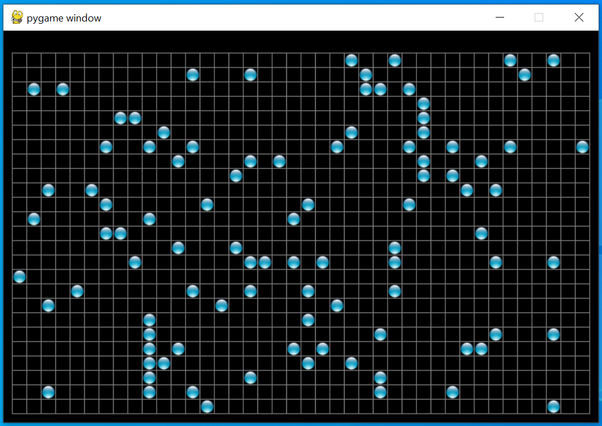

# Step 4: Make room for the menu

Next we will make some more room above the top border to add a menu. The 
menu icons are 16x16 pixels, so we need to add 16 pixels at the top of 
our window. We will introduce a new constant called `MENU_HEIGHT`, just 
in case we want to use different sized icons in the future. Let's start 
by changing the screen size so that we have room for the changes.

```python
MENU_HEIGHT = 16
BORDER_WIDTH = 10

SCREEN_HEIGHT = CELL_ROWS*grid_size + 1 + 2*BORDER_WIDTH + MENU_HEIGHT
SCREEN_WIDTH = CELL_COLS*grid_size + 1 + 2*BORDER_WIDTH

screen = pygame.display.set_mode((SCREEN_WIDTH, SCREEN_HEIGHT))
```

Now we need to adjust the position of the grid by adding the 
`MENU_HEIGHT` to all the y coordinates.

```python
# Draw horizontal lines.
for y in range(0, CELL_ROWS+1):
    pygame.draw.line(screen, GREY, (BORDER_WIDTH, y*grid_size + BORDER_WIDTH + MENU_HEIGHT),
                     (SCREEN_WIDTH-BORDER_WIDTH, y*grid_size + BORDER_WIDTH + MENU_HEIGHT))

# Draw vertical lines.
for x in range(0, CELL_COLS+1):
    pygame.draw.line(screen, GREY, (x*grid_size+BORDER_WIDTH, BORDER_WIDTH + MENU_HEIGHT),
                     (x*grid_size+BORDER_WIDTH, SCREEN_HEIGHT - BORDER_WIDTH))
pygame.display.flip()
```

Notice that we don't adjust the y position at the bottom of our vertical 
lines, that is because that change is built in to the change in the 
`SCREEN_HEIGHT`.

Finally we need to adjust the position of our cells on the y axis.

```python
for i in range(1,CELL_ROWS*CELL_COLS//10):
    screen.blit(live_cell, (random.randint(0, CELL_COLS-1)*grid_size + 1 + BORDER_WIDTH,
                            random.randint(0, CELL_ROWS-1)*grid_size + 1 + BORDER_WIDTH + MENU_HEIGHT))
    # time.sleep(0.2)
pygame.display.flip()
```

Now we have space to add our menu!

