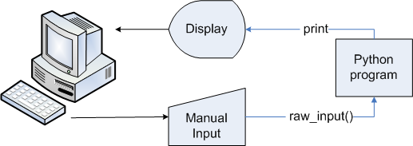
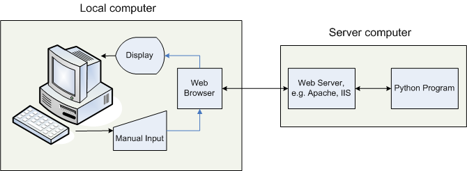
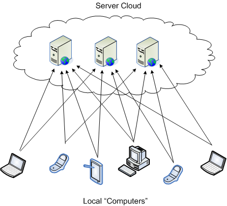

# Web Computing

What changes for the programmer with the move from local computing to
web computing? The system for local programming can be visualized like
this:

The user and the program interact more or less directly and the basic
I/O statements in most programming languages correspond to the devices
that have historically been used, thus `input` for fetching input and
`print` for displaying output (though the word print really harkens
back to line printers of old). There is of course an OS mediating
between the devices and the running program, but they are well developed
enough that they are almost invisible in the background.

The system for web programming on the other hand can be visualized like
this,

Now the program the user interacts with directly is the web browser
which communicates over a network (not shown in all its frightening
complexity here) with a server. The browser dispatches information to
the server and waits for a response from it which it then processes and
displays to the user.

Why isn’t there an analog to `input` and `print` for web programming?
Because the model of the connection between devices and computer is
quite different. On a local machine the user is assumed to have a 
continuous long-lived interaction with the running program. The program
is always paying attention to the users actions waiting for its chance
to respond: think back to the main event loop, or your Pygame based Game
of Life progams with the menus. Doing so when one server has to tend to
many running clients would be too bandwidth intensive so the web is
built on a very different protocol. One where interaction between client
and server takes place in discrete chunks with ideally no connection
between them. The client sends a complete free-standing request to the
server which processes it and returns a single one-time response and
then forgets about the client. To do this the client and server need to
agree on how they will communicate over that connection between
computers in the diagram above. We can mostly forget about all the
layers of network protocols that underlie the communcation because for
application programmers the relevant fact is that both computers marshal
and encode their information using the Common Gateway Protocl (CGI)
about which more on the next page.

Just before that though, the diagram above is too pedestrian to squeeze
money out of investors so the term ***cloud computing*** has been
coined. It rearranges the same elements in the following way and
represents the current age of computing, the age if you will of Google
and social media.

