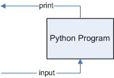

# Introduction to CGI

The previous page showed the following diagram of web-based programming.

Let’s look at this as application developers and focus on the software
components:

You can see that I have now labelled the arrows with the protocols of
immediate interest to us. HyperText Transport Protocol (HTTP) used to
communicate from client to server and CGI used both to communicate
between client and server and to communicate between programs on the
server.

CGI is commonly used as a shorthand for web programming. It actually
only refers to the Common Gateway Interface which isn’t a language or a
platform but simply a specification that describes how data from a
browser should be encoded to be sent to the server. Because that is a
necessary component of web programming, and also perhaps because it was
the first component to be favoured with an acronym, it is often used as
an umbrella term for much of web programming.

A decade ago one had to write one’s own code to parse CGI encoded
messages, but the standard has been around long enough that standard
libraries have evolved to take care of it and it has become almost
transparent to the programmer. Transparent enough that we can further
simplify this diagram and write our programs (mostly) as though the
situation was this:

which is not so different from the console-based programs we had been
writing:

Conceptually all we have to do is replace our text `print` statements
with ones that output HTML instead of plain text (since this is being
sent to a web browser), and to replace `input` statements with ones that
read in information from a web form.

1.  The first could be done just by using a lot more print statements,
    since HTML is a verbose format compared to plain text, but we will
    use string interpolation into triple-quoted strings to make it
    simpler.

2.  The second is easier than you might think since Python provides a
    module that will take the encoded data from an HTML input form and
    decode it into a dictionary whose keys are the names of the form
    elements.

Before we can explore those however we need to set up a web server to
use.
