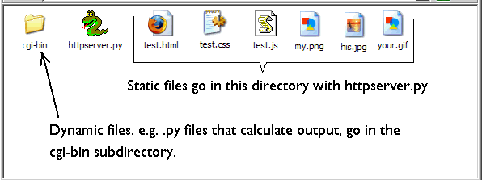
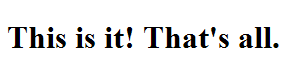

# Testing CGI serving

So far there isn’t much to brag about here. We can after all open html
files directly in our browser without servers getting in the way. But
this server also supports CGI-based communication (see those CGI
substrings sprinkled throughout?). To check that it is working as a CGI
server we need to test it with a Python program not a static HTML file.
The key thing to be aware of to make this work are the server’s
built-in assumptions about file layout. Files in the same directory as
it (’`.`’) will be served as static files. Files in its `cgi-bin`
subdirectory (’`./cgi-bin`’) will be served dynamically, i.e. it will
attempt to run them as Python programs and return the program’s output
to the client (i.e. browser). So things should be organized like this:



Go ahead:

1.  Copy and paste this code into a file named `testcgi.py` and save it
    in the `cgi-bin` directory.

    ``` python
    print('''Content-type: text/html

    <!DOCTYPE html PUBLIC "-//W3C//DTD XHTML 1.0 Transitional//EN"
          "http://www.w3.org/TR/xhtml1/DTD/xhtml1-transitional.dtd">
    <html xmlns="http://www.w3.org/1999/xhtml">
    <head>
      <meta http-equiv="content-type" content="text/html; charset=iso-8859-1" />
      <title>Test file</title>
    </head>

    <body>
    <h1>This is it! That's all.</h1>
    </body>
    </html>''')
    ```

2.  Navigate to `http://localhost:8080/cgi-bin/testcgi.py`. You should
    see this display in your browser:


