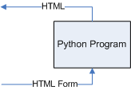

# Toward a real CGI program

Well our test cgi program was the equivalent of a 'hello world'
program. It sent some output so we could see that the system was
working, but it didn’t do any input or processing. That is by design of
course. Your first program in any new system should be dead simple so
that you can concentrate on getting the system bits _outside_ your
program connected together properly without having to worry about
problems _within_ your program. But having got those program-system
interactions working it’s time to tackle complete programs.

Recall that we have two main things to sort out within our programs (as
opposed to the myriad relations of our programs to things outside
themselves like systems and server software):

1.  Producing HTML for the browser instead of text for the console.

2.  Getting our input from HTML forms instead of the console.

We saw on the previous page that 1. could still be done using `print`
statements since HTML is also a textual format. So let’s turn our
attention to 2.
