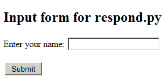

# The input form

We’ll need a pair of files: the original HTML file that presents a form
to fill in with input values, and a Python program that processes the
form values and returns some output. Here’s our input form
`respond.html`:

``` html
<!DOCTYPE html>
<html lang="en">
<head>
  <meta charset="UTF-8" />
  <title>Input form for respond.py</title>
</head>
 
<body>
<h2>Input form for respond.py</h2>

  <form method="post" action="cgi-bin/respond.py">
    <p>Enter your name: <input type="text" name="user" /></p>
    <p><input type="submit" /></p>
  </form>

</body>
</html>
```

Viewed in the browser it will look something like this,



Everything is set up by the lines of the form element:

    <form method="post" action="cgi-bin/respond.py">

This line says that when the `Submit` button is clicked the form data
should be sent to the program `cgi-bin/respond.py` on the server.

        <p>Enter your name: <input type="text" name="user" />

This line gives a name to the contents of the input box. Within our
program we will be able to identify it by the index `"user"`.

        <p><input type="submit" /></p>

This line places the `Submit` button on the screen. Nothing is sent to
the server until this button is clicked, but as soon as it is clicked
the form contents are encoded and forwarded to the server. The `Submit`
button is the GUI counterpart to pressing the `Enter` key in the IDLE
shell.
