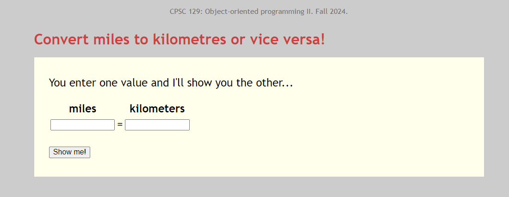

# Fancier output

Fancier output isn’t really a concern for us in the context of this
course. It’s a matter for your project’s graphic designers. But it’s
pretty unsatisfying to produce downright ugly interactions so feel free
to indulge in some CSS wizardry to dress up the input and output.
Because this,

while no work of art, is nicer than this,

If CSS is brand new to you, I’ll provide some boilerplate cosmetic
enhancements for your assignment programs.
