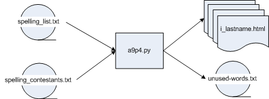

# Data Processing View

The overall processing flow then is:

    The processing steps are straightforward:

    get the name of the word list from the user
    get the name of contestant list from the user

    read in the word list
    read in the contestant list
    for each contestant
        select 10 words at random from the word list
        remove the words from the word list (so they will not be used more than once)
        write this contestant's html file
    write out the reduced word list (unused_words.txt)
