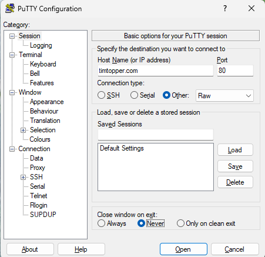

# Browsing without a browser

The graphic displays provided by modern browsers can obscure the fact
that behind the scenes it’s all text. In case seeing helps you with
believing you can still issue the requests by typing them and see the
text responses.

The trick is to talk to the server (webserver in our case, but this also
works for others like email, ssh, ftp, time, etc.) directly (i.e.
without invoking a client like a web browser or an email program) using
a terminal program. All you need is to know the protocol.

If you want to follow along you can use the free program
[PuTTYtel](http://www.chiark.greenend.org.uk/~sgtatham/putty/download.html).
Configure it as follows to access web servers, noting that connection
type needs to be “raw” not “telnet”:

Then you can fetch the server’s index (or home) page by typing a GET
request:

[GET / HTTP/1.0]{.kbd}

followed by two Enter’s: the first to send the GET request, and the
second to send a blank line signalling the end of the headers (even
though there aren’t any). The slash (/) indicates that you are asking
for the root document on the server. Many servers will map this request
to a file called index.html (and soon we will see how they do this!).

This is all a browser does when you click a link: it issues a GET
request for the resource identified by the link URL.
