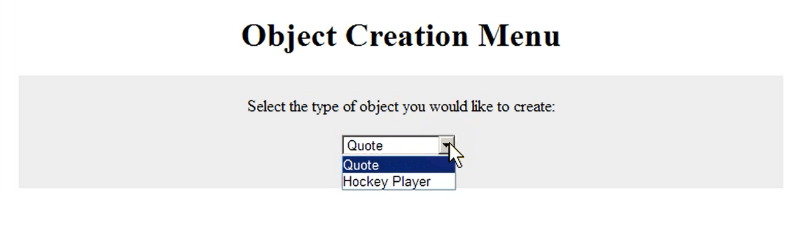

# Towards an object server: #2 Object creation menu requirements

The new version of our object creation page should have a dropdown to
allow the user to select the creation form of the object they want to
add.

This will change the mapping of our actions. We are going to have to add
a new step when we create a new object. We are going to have a new GET
method to generate the `object_creation_menu`. We will also need the
`object_creation_form` to detect the object type being asked for.

  <table class="dark">
  <col>
  <col>
  <col>
  <col>
  <tbody>
    <tr>
      <th>Action</th>
      <th>HTTP Method</th>
      <th>URL</th>
      <th>Python Methods and Actions</th>
    </tr>
    <tr>
      <td>List all objects</td>
      <td>GET</td>
      <td>/</td>
      <td>model.listall() + display entries as HTML</td>
    </tr>
    <tr>
      <td>Retrieve an object</td>
      <td>GET</td>
      <td>/uid</td>
      <td>obj = model.retrieve(uid) + display as HTML, i.e. obj.HTML()</td>
    </tr>
    <tr>
      <td>Create a new object</td>
      <td>GET</td>
      <td>/object_creation_menu</td>
      <td>New code: to return menu form</td>
    </tr>
    <tr>
      <td></td>
      <td>GET</td>
      <td>/object_creation_form</td>
      <td>new: detect objtype being requested and then return a static HTML page containing the form for that object type</td>
    </tr>
    <tr>
      <td></td>
      <td>POST</td>
      <td>/create/objtype</td>
      <td>obj = Quote() + model.create(obj) + display new object as HTML, i.e.
        obj.HTML()</td>
    </tr>
    <tr>
      <td>Delete an object</td>
      <td>DELETE</td>
      <td>/uid</td>
      <td>model.delete(uid) + model.listall() + display entries as HTML</td>
    </tr>
    <tr>
      <td>Update an object</td>
      <td>GET </td>
      <td>/uid/HTML_update_form</td>
      <td>new: return uid's update_form(), i.e. obj = model.retrieve(uid) +
        return obj.HTML_update_form()</td>
    </tr>
    <tr>
      <td></td>
      <td>PUT</td>
      <td>/uid</td>
      <td>new_uid = model.update(uid, obj) followed by obj =
        model.retrieve(new_uid) + display as HTML, i.e. obj.HTML()</td>
    </tr>
  </tbody>
</table>

So what does the code need to look like to incorporate these changes?
