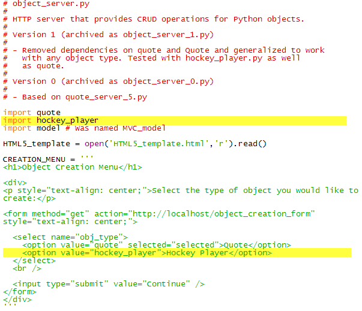

# Something we’re not doing... ...but I thought you might notice, and so should explain.

The eagle-eyed among you with good memories as well might recall seeing
earlier a placeholder labelled Automatically building the object
creation form”. It seemed like a good idea at the time (programmers
always want to automate things!), but it’s gone now.

It would be nice in a production system to automate the object creation
menu so that when a new object type is added to the system the form is
automatically updated, but it would mean organizing the object classes
into a subdirectory, and using some new import mechanisms, and writing
some detailed code. Nothing tricky, but too many fussy details to deal
with.

Meanwhile we don’t have much to change manually in our system when we
add a new object type. In fact there are only two places near the top of
the file and near each other, where we need to make additions:

{width="604" height="561"}

Given the ease of the edits it doesn’t seem worth the effort to
automate this particular task.
