# Test Images

We’ll also need some images to work with. Here are a few (you can also
use photographs you have taken, or images you find on the web):

-   Blocks world: [3blks1.png](3blks1.png), [shapes2.png](shapes2.png),
    [allblcks.png](allblcks.png), [bcrbohsp.png](bcrbohsp.png).
-   Textures: [512test2.png](512test2.png).
-   Nature: [boulder.png](boulder.png), [wave-cld.png](wave-cld.png).
-   Misc: [calcium.png](calcium.png), [fngrprnt.png](fngrprnt.png),
    [Bikesgray.png](Bikesgray.png).
-   People: [Che_GS.png](Che_GS.png), [faces1.png](faces1.png).
-   Animals: [zebras.png](zebras.png), [penguins.png](penguins.png).

3blks1.png\
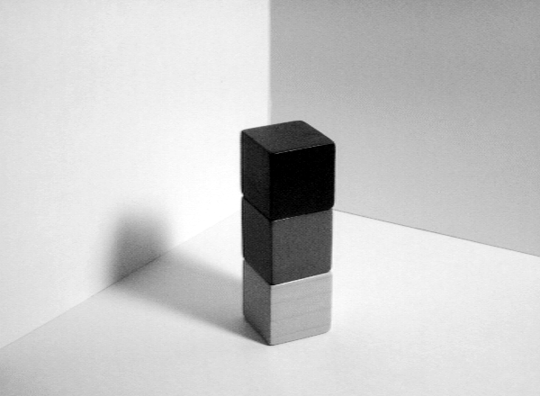

shapes2.png\
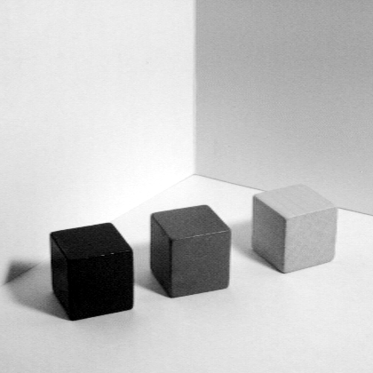

allblcks.png\
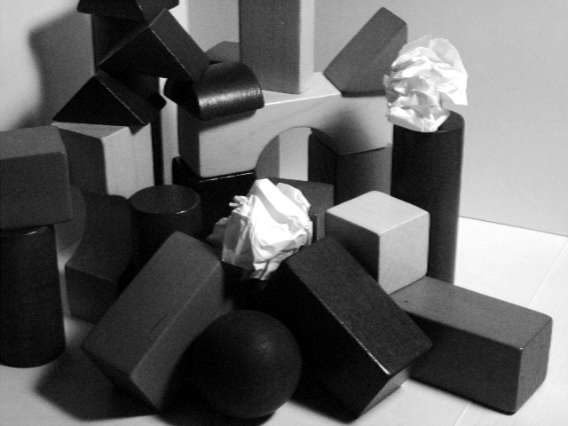

bcrbohsp.png\
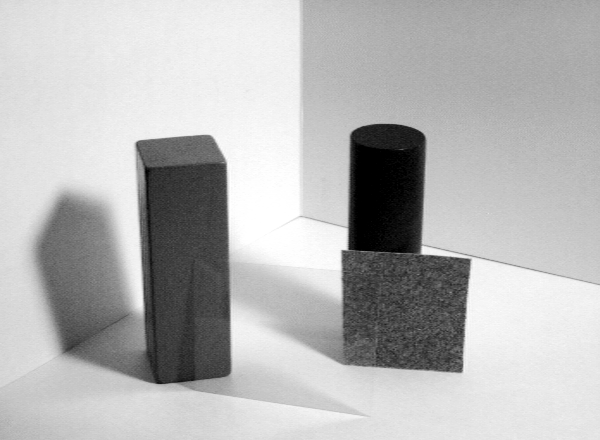

512test2.png\
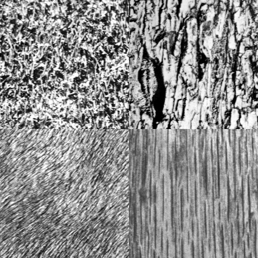

boulder.png\
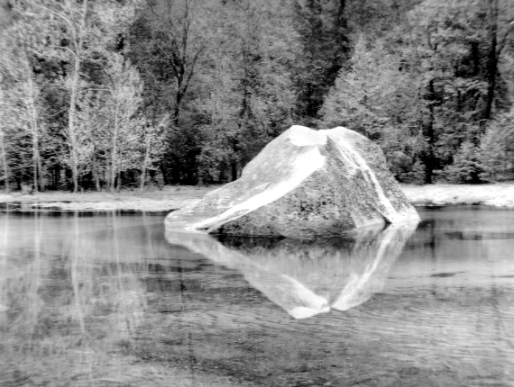

wave-cld.png\
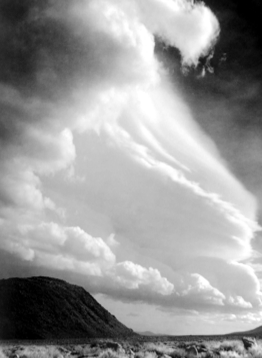

calcium.png\
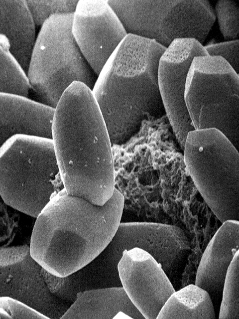

fngrprnt.png\
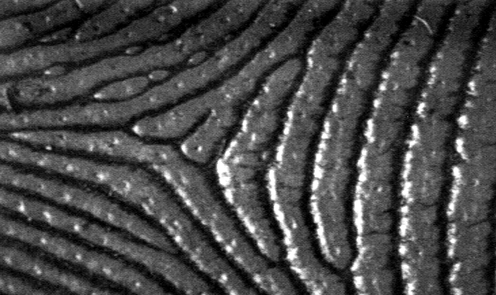

Bikesgray.png\

Che_GS.png\

faces1.png\
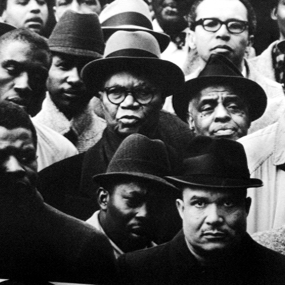

zebras.png\
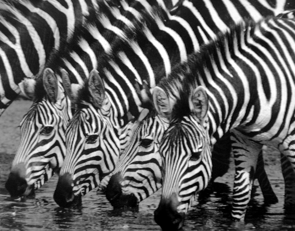

penguins.png\

