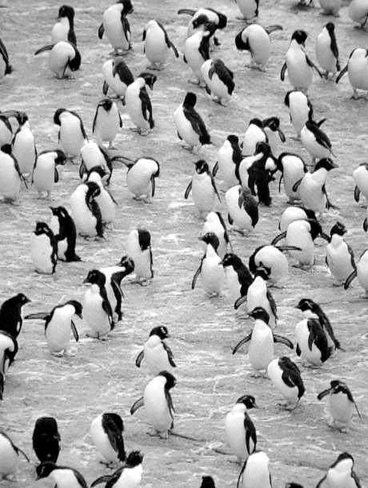

# IPO Programming

With pillow installed and some test images to play with we can move on
to image processing. In its overall structure image processing turns out
to be a throwback to the beginning of CPSC 128 where we did IPO or
Input, Processing, Output, programming. We’ll need to input images,
process them, and then output the processed result.

## Input

Reading in an image:

``` python
from PIL import Image

im = Image.open("penguins.png") # Opens the file and returns an image object.
im = im.convert("L") # Convert to a greyscale image.
```

## Processing

Now to work with the image we’ll need to be able to manipulate the
pixel values. To do this PIL provides pixel map access objects”.

``` python
# pix is a "pixel map access object" for the image named im.
pix = im.load() 
```

`pix` gives us direct access to the pixel values in the image similar to
the way `u.cells` gave us acess to the cell values in a life universe.
For a greyscale image the values in `pix` will range from 0 for black,
to 255 for white, with numbers in between representing shades of grey.

The notation we use with pix is slightly differently from `u.cells`
though, e.g. to display the pixel values of the 10 × 10 region of pixels
in the upper left corner of the image:

``` python
# pix coordinate system is [x, y],
# with [0, 0] in the upper left corner of the image,
# x measuring across the image, and y down the image.
for x in range(10):
    for y in range(10):
        print(pix[x,y], end= ' ')
    print()
```

The key thing to notice is that we have to use the notation `pix[x, y]`
not `pix[x][y]`. Other than that we can treat our pixel map access
objects” like `pix` as though they were lists of lists.

The output from the code above is:

    162 155 155 162 164 158 136 107 86 125
    168 168 164 164 166 162 142 109 88 123
    171 164 164 175 179 171 144 109 94 133
    181 171 169 182 179 166 153 125 90 127
    181 184 188 190 182 168 153 131 105 145
    177 186 186 184 181 173 158 136 110 145
    181 186 186 182 177 169 153 131 112 147
    182 184 182 179 175 175 168 149 116 134
    173 175 177 175 173 173 173 160 129 142
    160 158 158 164 168 171 177 168 140 145

(This might remind you of [the topography problem in CPSC
128](https://ttopper.github.io/CPSC128/07_Dictionaries/90_Assignment_7/),
and indeed in mathematical terms it is the same.)

## Output

Having read our image in, let’s process it and output the result.

``` python
print(im.size) # im.size is a tuple giving the size of image (cols,rows)

for x in range(im.size[0]):
    for y in range(im.size[1]):
        pix[x,y] = tuple(num//2 for num in pix[x,y])
        
im.save("dkpenguins.png")

print('Done.')
```

Note that pillow will try to guess the file format to write based on the
filename suffix (in this case png). You can also provide a format
argument to specify the desired format.

Here are the before and after images:

 

As you can see, the effect of dividing each pixel value by 2 was to
decrease all the pixel values and thus darken the image.

 

