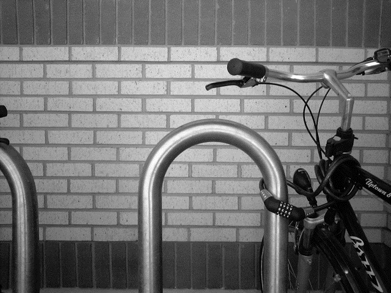
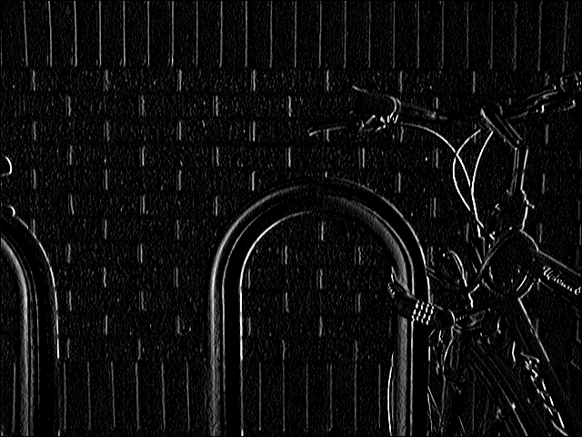
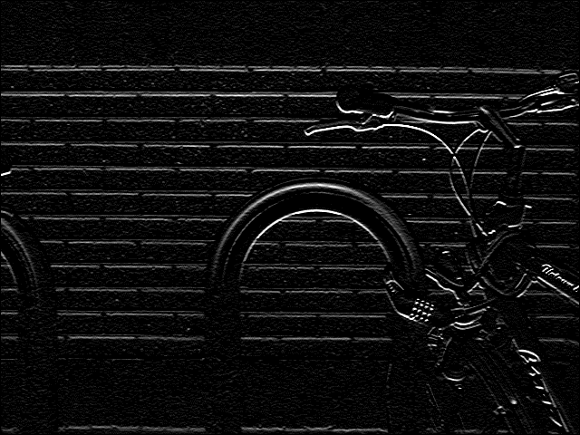

# Edge Detection

Edge detection is a first step in many machine vision systems. The idea
is to identify the edges in the image and to use these edges as the
basis for object recognition algorithms. What does “edge” mean in this
context? It means the visual edge between two regions of an image.
Thinking back to the topography assignment in CPSC 128, edges are
cliffs. At the visual boundary of a penguin’s back against the
background we will have a patch of black pixels next to a patch of light
grey ones. The strength of the edge is like the height of the cliff.
This suggests that we can measure the strength of the edge at a point by
finding the difference between the pixel values on its left and those on
its right. In order to get at the idea that an edge has a length to it,
we will subtract not just the immediately adjacent pixel values but also
the ones above and below.

In image processing these operations are often described using a _mask_.
In this case the mask corresponding to measuring vertical edge strength
would be:

<table border=1><tr><td>-1</td><td>0</td><td>1</td></tr>
<tr><td>-1</td><td>0</td><td>1</td></tr>
<tr><td>-1</td><td>0</td><td>1</td></tr></table
>
If the pixel in the center of the mask is `pix[x,y]` then this mask
tells us to perform this calculation in Python:

    dx = -1 * pix[x-1, y-1] + 0 * pix[x, y-1] + 1 * pix[x+1, y-1] \
         -1 * pix[x-1, y  ] + 0 * pix[x, y  ] + 1 * pix[x+1, y  ] \
         -1 * pix[x-1, y+1] + 0 * pix[x, y+1] + 1 * pix[x+1, y+1]

The 0s and 1s are only included for clarity and wouldn’t be included in
an actual program.

A similar mask can be used to measure horizontal edge strength:

<table border=1>
  <tr>
    <td>-1</td>
    <td>-1</td>
    <td>-1</td>
  </tr>
  <tr>
    <td>0</td>
    <td>0</td>
    <td>0</td>
  </tr>
  <tr>
    <td>1</td>
    <td>1</td>
    <td>1</td>
  </tr>
</table
>
Now as in the game of life where we couldn’t change cell states as we
ran through the universe aging cells, we can’t change pixel values as
we go through the image because those changes would affect the results
for the neighbouring cells we haven’t reached yet. The solution is the
same here as it was in the game of life: we write the new values into a
~~parallel universe~~ new image. Here’s the Python code to do this:

``` python
from PIL import Image

im = Image.open("Bikesgray.png") # Open the file and returns an image object.
im = im.convert("L") # Convert to a greyscale image.
pix = im.load() # Load the image pixel map for easy access

# Create new images to hold horizontal and vertical edge strength values.
# dx for horizontal edge strengths.
dx = Image.new("L", im.size) # On creation dx is filled with 0s.
dxpix = dx.load()
# dy for vertical edge strengths.
dy = Image.new("L", im.size)
dypix = dy.load()

for x in range(1, im.size[0]-1): # Q: Why does this start at 1 and not 0?
    for y in range(1, im.size[1]-1): # Q: Why does this go to im.size[1]-1 and not im.size[1]?
        dxpix[x,y] = pix[x+1, y-1]+ pix[x+1, y]  + pix[x+1, y+1] \
                     - pix[x-1, y] - pix[x-1, y-1] - pix[x-1,y+1]
        dypix[x,y] = pix[x-1, y+1]+ pix[x, y+1]  + pix[x+1, y+1] \
                     - pix[x-1, y-1] - pix[x, y-1] - pix[x+1,y-1]

dx.save('dx.png')
dy.save('dy.png')

print('Done.')
```

And here’s the result for a new image (chosen because it has strong
horizontal and vertical edges). First the new image:



And now the output, `dx` on the left and `dy` on the right (scaled down
in size so you can see them side-by-side):

{width="320"} {width="320"}

You can see that each mask favours (or detects) edges in the specific
orientations we would expect, e.g. either the tops or the bottoms of the
bricks, and either the top or the sides of the curved metal bike rack.

 

