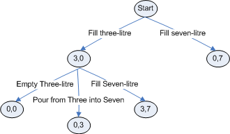
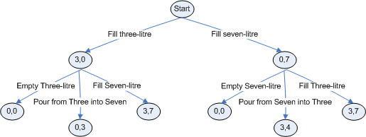

# Formalize the Algorithm

Let’s think a bit about how the process of trying all combinations”
of actions might play out. We’ll start with the first problem,

> You are at the side of a river. You have a three-litre pitcher and a
> seven-litre pitcher. The pitchers do not have markings to allow
> measuring smaller quantities. You need four liters of water. How can
> you measure four liters?”

Remember our possible actions are: _fill_, _pour_ and _empty_.

Since the pitchers are empty we can’t pour from or empty them, but we
can fill them, so we have two possible actions: fill the three-litre
pitcher, or fill the seven-litre pitcher. Each of those results in a new
state of the pitchers:

You can see I’ve introduced some notation here. The pairs of numbers in
the ovals represent the number of litres of water in each pitcher,
listed in order of pitcher size, smaller pitcher first. Now neither of
those ovals features a 4, the amount we are aiming for, so we are not
done. Let’s consider our next possible actions. From the state 3,0 we
could; empty the three-litre pitcher, pour from the three-litre pitcher
into the seven-litre pitcher, or fill the seven-litre pitcher.

And now you can see what we’ve got! We’re building a tree of
possibilities. From each state, taking each of the possible actions
extends the tree downwards into new states. We’ll be done when one of
those states contains a 4 (or thinking back to our earlier observation
of multi-pitcher solutions when a subset of our states adds to 4).
There’s no 4 in any of the states we’ve reached so far so we’re not
done. But now the question arises, how shall we grow our tree? Should we
continue down the left-hand side and expand on the 0,0 state, or move
over to the right branch and continue from the 0,7 state? The first
strategy is called a *depth-first search* while the second is a
*breadth-first search*.

Depth-first means you grow as deep as it is possible to grow along one
route and then if it dead-ends and is not a solution, back up and try
growing another path. We’ve used that approach before. For example our
maze-carving algorithm grew each path until it couldn’t grow any more,
and then it backed up the list of visited cells and grew another path.
The problem with depth-first explorations in some problems is that the
path might be infinite, i.e. you might be able to grow it forever
without reaching the solution. That could happen here where we could
become stuck in a loop of filling then emptying then filling then
emptying a pitcher (we know that’s not going anywhere, but the
algorithm might not). In most game-playing situations (like this one)
breadth-first is the way to go.

In this case that means our next step is to grow down from the 0,7
state:

and we reach the solution in the state 3,**4**!
