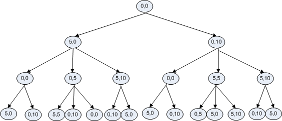
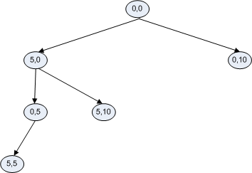

# An edge case leads to a refinement

This is the basic algorithm, but we have to watch out for edge cases.
One important edge case is problems that don’t have a solution, like
the aforementioned problem of measuring one litre given a five-litre and
a ten-litre pitcher. Consider the search tree that results:

After three rounds of actions we have seen all the possible states. All
the new states we generate are ones we have seen before, and we know
they are not solutions, so the process will not terminate and we will
have an infinite loop. The solution? Remember the states we have tried,
and don’t add tried states to `statelist`. If we do that then
`statelist` will be emptied and that will terminate the program.

    goal = 4
    statelist = [(0,0)]
    tried_states = []
    while len(statelist) > 0 and 4 not in statelist[0]: # BUG!
          # BUG above: misses multi-pitcher solutions!
          state = statelist.pop(0) # remove first state from statelist
       add state to tried_states
       for every pitcher in state
           If the pitcher isn't empty:
               empty the pitcher --> new state
               if new state not in tried_states:
                   add new state to statelist
            If the other pitcher isn't full:
               Pour from the pitcher into the other pitcher 
               if new state not in tried_states:
                   add new state to statelist
           If the pitcher isn't full:
               fill the pitcher --> new state
               if new state not in tried_states:
                   add new state to statelist
    # We end up here if it is solved, but also if it is unsolvable
    # so we need to check which it is:
    if 4 in statelist[0]:
        Solved!
    else:
        Unsolvable :-(

By remembering states we have tried, we not only terminate instead of
looping forever, we search fewer options: Correct _and_ Efficient!

