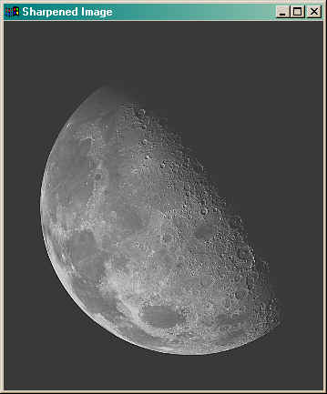

# Dynamic Range

 

Often we receive pictures that are dark” because they were
underexposed, or washed out” because they were overexposed, and
sometimes we create them as a result of our processing. For example:

 

One way to enhance images like these is to increase their dynamic range.
An image’s dynamic range is the range of pixel values it uses.
Greyscale PIL images assign each pixel a value from 0 to 255
(inclusive). The problem with the images above is that they don’t take
full advantage of this range. The penguin image has an upper limit far
less than 255, and the moon image doesn’t have any true blacks because
its pixel values don’t go as low as 0.

The mathematical problem of dynamic range is to take an image with pixel
values in the range [_a_,_b_] and reassign them so they use the range
[0,255]. We can do that by subtracting _a_ from each pixel value to
shift the range of pixel values so it starts at 0, and then multiplying
each shifted pixel value by the ratio of the maximum shifted pixel value
in the image to 255. This will make the new maximum pixel value in the
image be 255 (while leaving the 0 values at 0 because that’s how
multiplication works).

_What could go wrong_?

-   Do it by hand first: Before coding it check your formula on an
    example. Imagine you have an image with pixel values in the range
    [50,100]. Your formula should turn 50 into 0 and 100 into 255.
    Check that it does.

-   Watch out for integer arithmetic! Remember that integer division
    truncates so you might need to a) change what seems like the
    natural” order of operations to let your numerators grow before
    dividing them by potentially large denominators, or alternatively b)
    use floating point values for some parts of calculations. For
    example if we get 12 out of 15 on a test and calculate our
    percentage grade using the obvious” formula 12/15 * 100 with
    integer arithmetic we will get 0, because 12/15 is 0 and 0 times 100
    is still 0. Instead we need either to rearrange this expression as
    12 * 100 /15 to get 80 (since 12*100 = 1200 and 1200/15 = 80), or
    use floating point values, 12.0/15 * 100, to get 80.0 which we can
    then convert to 80 if we need an integer result.
