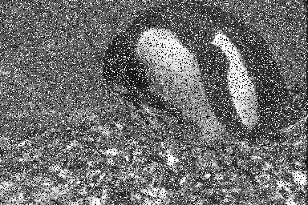

# Noise Filtering

Real world measurements always contain noise or errors. These errors are
_random_ perturbations of the true signal that occur in the measuring
process. _Systematic_ errors can be modelled and that model used to
remove them exactly to recover the original measurement or true signal.
For example if you are using a metre stick to measure things and you
know that a 5 cm piece has been cut off the low end you can adjust your
measurements by adding 5 cm to them, and thus get an accurate
measurement. With random errors on the other hand we either don’t know
why or how they occurred, or we can’t model the process we suspect
produced them, so we can’t remove them precisely. For example aerial
photographs that are attempting to capture a picture of the land surface
below are affected by the fact that the atmosphere between the camera
and ground is neither transparent nor homogenous.

Since we can’t remove random error precisely we instead try to reduce
its effect. In image processing this means we want to reduce its visual
impact on the image.

One common type of noise in some image acquisition systems is salt and
pepper or data drop-out noise. This kind of noise can be caused by
errors in data transmission. The result is corrupted pixels that are
either set to the maximum value or the minimum value in the image, i.e.
in PIL terms to 0 or to 255. The result is to create black and white
pixels in the image so it looks like it has had some salt and pepper
sprinkled on it.

Here’s an image with 5% and 25% levels of salt and pepper noise:

Median filtering is an effective technique to reduce the visual impact
of salt and pepper noise. It replaces the value of each pixel by the
median value of the pixels in its local neighbourhood. This is effective
because the salt and pepper pixels are unlikely to be the median value
in the neighbourhood and so are generally replaced. The removal isn’t
perfect because the values we replace the noise pixels with probably
aren’t exactly what the true value is (the median is just a reasonable
estimate for the likely value), and other, non-noise, pixels will also
be affected and replaced.

It would be nice to be have an idea of how effective our filtering is.
One measure we can use is the root mean square error between the noisy
image and the true” image. Of course in applications we don’t have a
true image, just a noisy one, but we can estimate the performance of the
filter on actual images, by creating our own noisy ones, and seeing how
the filter performs on them.
