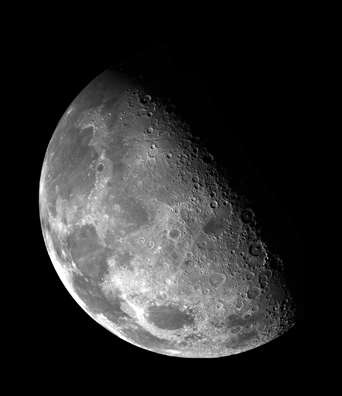
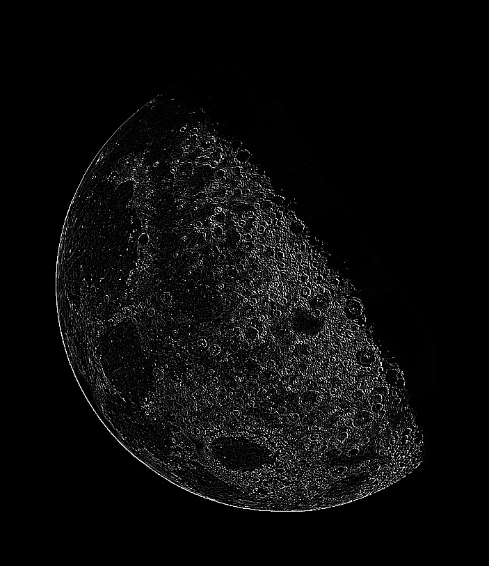
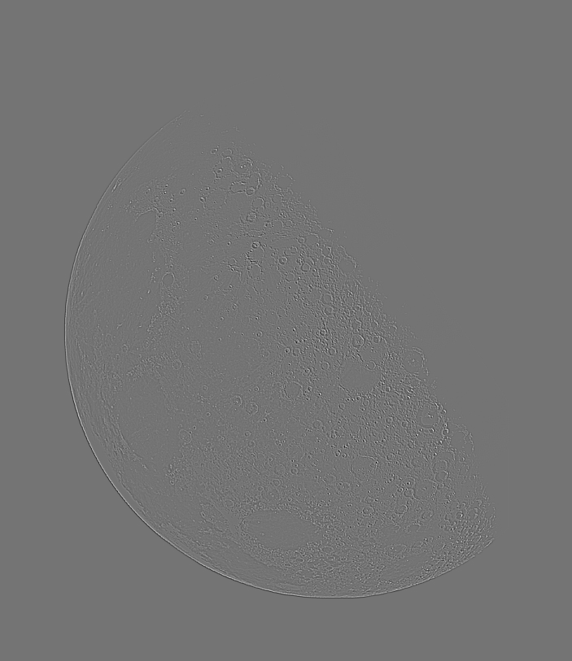
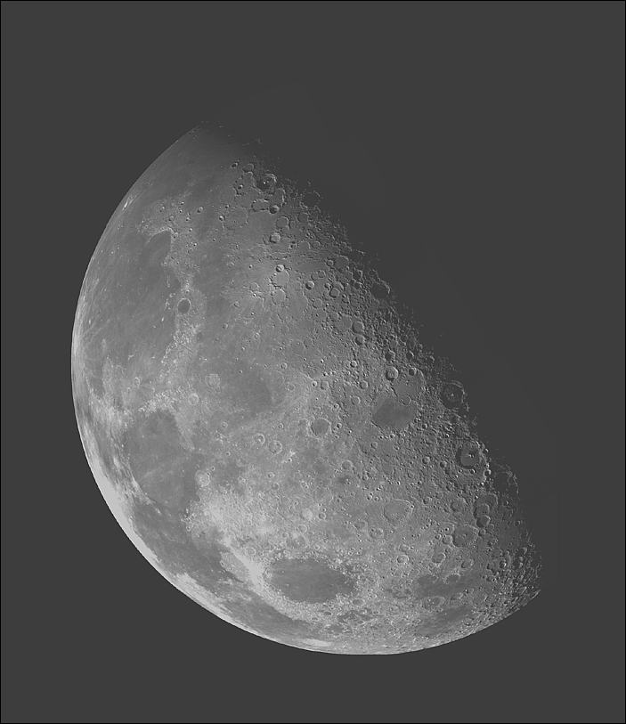
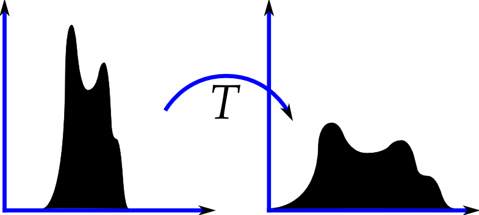

# Sharpening

Well so far we’ve looked at enhancing images suffering from exposure
problems and random noise. Another common source of image degradation
are lens” issues resulting in poor focus and soft or blurred images.
Lens” is quoted because focus-like issues arise even in image capture
techniques that do not rely on an optical lens.

One of the least desirable effects of capturing an image with an
imperfectly focussed lens is that the edges in the image are blurred. We
can use an edge filter to enhance the edges in the image. For example on
the left below (or above if your window is narrow) is an original image
and on the right (or below) is the sharpened version.



If you examine the images closely you should be able to see that the
edges in the second image are sharper and the contrast higher. Here’s
how to achieve this.

1.  First apply a Laplacian filter to the image. The edge filter we used
    [last time around](../10.2_IP_1/06_Edge_detection.md) is the
    Prewitt operator. It’s a first order operator, also called a
    gradient filter, that is a discrete approximation to a first
    derivative (_discrete_ as opposed to _continuous_ since our pixel
    values make up a discrete rather than continuous function). The
    Laplacian operator is a second order filter that approximates the
    second derivative. Any image feature with high curvature, i.e. a
    sudden change in intensity, will be enhanced by a Laplacian filter
    so it is a good candidate to restore fine detail that may have been
    lost due to imperfect focus.

    The mask for the Laplacian filter is,

    <table border=1><tr><td>-1</td>
    <td>-1</td>
    <td>-1</td></tr>
    <tr><td>-1</td>
    <td>8</td>
    <td>-1</td></tr>
    <tr><td>-1</td>
    <td>-1</td>
    <td>-1</td></tr></table
    >

    Applying it to the original image produces this image which captures
    both the fine detail and the strong edges from the original image.

    

    (_What could go wrong_? The mask can produce negative values. What
    will PIL do with these when you save them into the image object?)

2.  Next we want to add the features we’ve extracted back into the
    original image. To do that we need to scale the filtered data back
    into the same [0, 255] range as the original image.

    The scaled Laplacian image looks like this:

    

    (_What could go wrong_? Watch out for integer arithmetic!)

3.  Finally we’re ready to add the filter output back into the original
    image. After adding it and adjusting the dynamic range you should
    get this:

    

    (_What could go wrong_? When you add the two images you may get
    values larger than 255, what will PIL do when you save those into
    the image? Don’t overlook the phrase _and adjusting the dynamic
    range_” above.)

4.  If we look hard we can see that finer detail is more visible in this
    image, but the image as a whole appears lighter than the original.
    This isn’t because it doesn’t use the full of pixel values. Check
    the image and you will see that its values range from 0 to 255. The
    problem is a little more subtle: the distribution of the pixel
    values is not the same as it was in the original image. Perhaps
    something like this:

    {width="392"}

    We can correct for that by equalizing the distribution of pixel
    values in this image to the distribution of pixel values in the
    original. (A function to do the histogram equalization is provided
    below.) Doing that gets us this image:


```python
def equalize(input_image, model_image):
    ''' Returns eq_image a version of input_image whose pixel values have been
        equalized so its histogram will match model_image's histogram.
        
        Leaves input_image and model_image unchanged.
        
        See http://en.wikipedia.org/wiki/Histogram_matching and 
        http://en.wikipedia.org/wiki/Histogram_equalization for 
        background.

        Outline:
        1. Build histograms of the grey level values in each image.
        2. Build cumulative distributions (CDFs) of the grey level values in
           each image from the histograms.
        3. Use the CDFs to build a pixel value lookup table (LUT).
        4. Loop through the input image and use the LUT to assign
           new equalized pixel values.
    '''
    # 1. Get the grey level histograms for each image.
    input_histogram = input_image.histogram()
    model_histogram = model_image.histogram()
    # print input_histogram, 'n', model_histogram # DEBUG
    # Minimal error checking to avoid annoying failures.
    if len(input_histogram) != len(model_histogram):
        print 'Error: Histograms do not have same length!'
        return
    if len(input_histogram) != 256 or len(model_histogram) != 256:
        print 'Error: Histograms do not use full 0-255 range of values!'
        return

    # 2. Build the Cumulative Distribution Functions (cdf's) for each image
    # TODO: s/b a separate function.
    input_cdf = input_histogram[:]
    for i in range(1, len(input_cdf)):
        input_cdf[i] = input_cdf[i] + input_cdf[i-1]
    model_cdf = model_histogram[:]
    for i in range(1, len(model_cdf)):
        model_cdf[i] = model_cdf[i] + model_cdf[i-1]
    # print input_cdf, '\n', model_cdf # DEBUG

    # 3. Build a lookup table (lut) that will let us look up a pixel value in
    # input_image to see what it should become in the equalized image.
    lut = 256*[0]  
    # The rule is to assign each lut entry the index (grey level) of
    # the first entry in model_cdf that is greater than or equal to
    # input_cdf's entry.
    grey_level = 0
    for input_cdf_index in range(len(input_histogram)):
        while model_cdf[grey_level] < input_cdf[input_cdf_index]:
            grey_level += 1
        lut[input_cdf_index] = grey_level
    # print lut # DEBUG
    
    # 4. Create the equalized image, eq_image, by looping through input_image
    # using the lut to assign pixel values for eq_image.
    eq_image = Image.new("L", input_image.size) 
    eq_pix = eq_image.load()
    input_pix = input_image.load()
    for x in range(im.size[0]):
        for y in range(im.size[1]):
            eq_pix[x,y] = lut[input_pix[x,y]]
            
    return eq_image
```

(Don't worry about the TODO in there, it's for me not you.)