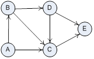

# Exam Study Guide

Just what you were sent by email, but saved here for posterity.

    Some things that WON'T be on the exam:

    * No new long code chunks to read and understand. Reading code is a slow process, 
    and difficult to do quickly.

    * No new problem domains to wrap your head around.

    * No class inheritance though small, simple classes may appear.

    The exam is NOT comprehensive, i.e. it does not test everything we covered this 
    semester. Your ability to do most things has already been assessed through the 
    assignments. Look closely at the descriptions of the problems so you will know what
    to study and prepare for.

    The exam is out of 180 marks, and you have 180 minutes to write it, so the value of
    a question gives you a rough idea of how long you should spend on it.

    The exam has 8 problems:

    Problem 1 (30 marks)

    Three parts that each begin: "What output does the following code fragment 
    produce?"

    (Hint: Watch out for references.)

    Problem 2 (10 marks)

    Four parts: "Which of the six main sorting methods we studied (straight insertion, 
    straight selection, straight exchange/bubble, Shell sort, quicksort and heapsort) 
    would you implement for each of the following applications? Briefly explain why in 
    each case."

    Problem 3 (10 marks)

    Two parts each with the form:  "What does the acronym _____ stand for? What is the 
    rationale for this _______?"

    Problem 4 (15 marks)

    Four parts each with the form: An O(_) algorithm takes ____ to process a _____. How
    long will it take to process a ____?

    (Hint: Just like a2p2 and a3p1)

    Problem 5 (25 marks)

    Write two functions to work with binary trees stored in lists.

    (Hint: Functions similar to those in a7p3).

    Problem 6 (30 marks)

    Design a data representation: "Conduct an OO analysis of this ____, i.e. identify 
    the type(s) of object(s) it contains, and the attributes of each type. Write the 
    class statements and  __init__ methods for the object type(s) you have identified."

    (Hint: Know our design of the maze representation).

    Problem 7 (30 marks)

    Implement an algorithm drawing on sorting techniques.

    (Hint: Know your sorts and the techniques they used for implementation)

    Problem 8 (30 marks)

    Involves writing a function to work with graphs like this,

    represented like this:

        g = { 'A': ['B', 'C'],
              'B': ['D', 'C'],
              'C': ['E'],
              'D': ['C', 'E'],
              'E': []
            }

    (Hint: Know the pitcher problem solving algorithm.)
