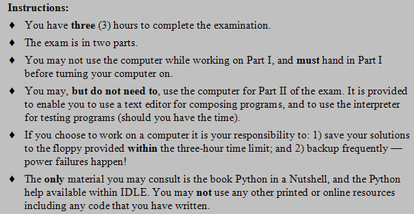
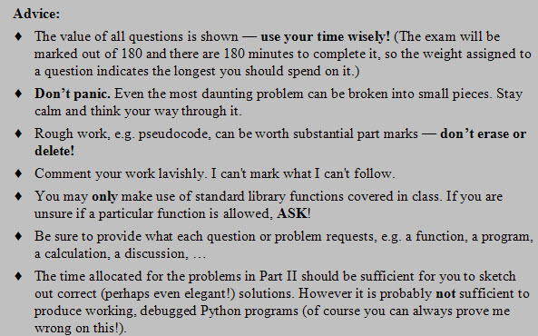
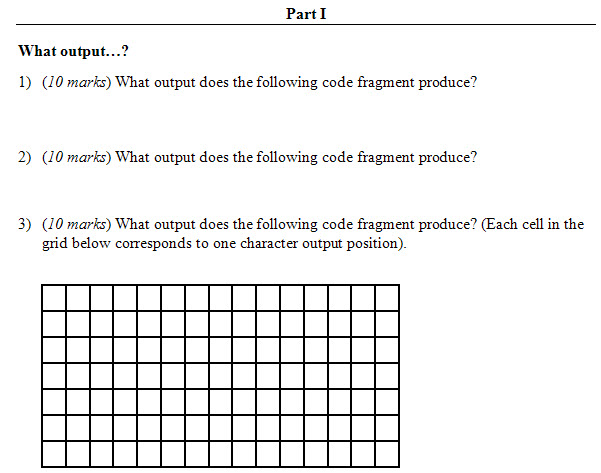
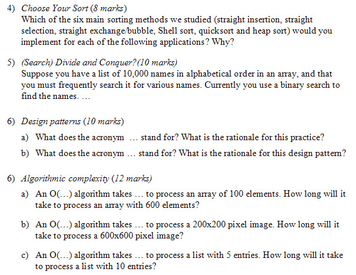
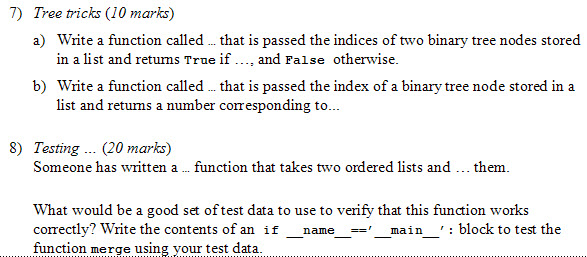
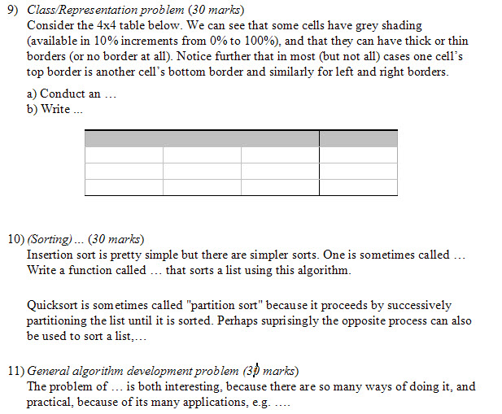

# Redacted Final Exam

(aka As much as I can tell you about without actually showing it all
to you”)

    Tara: Hello
    Tim Topper: Hi Tara. Don't have my headset on yet. Just need to upload some images.
    Tara: ok
    Tim Topper: Aah! The system doesn't see my headset. Here look at this while I fiddle.

    Tara: where would we get python in a nutshell?
    Tim Topper: It's available as a printed book and an ebook from O'Reilly publishing.
    Tim Topper: It's an excellent compact reference to the language. Reference means it doesn't explain much.
    Tara: that is for part 2 only?
    Tim Topper: Just shows you the details, e.g. if you want to see a list of string methods.
    Tim Topper: Oh, I see why you are asking. Sorry that is an old instruction, from a term where it was a required text.
    Tim Topper: I'll remove that...
    Tim Topper: I'm going to try one more thing to get sound going. Be right back. (I hope).
    [...15 minutes later...]
    Tim Topper: There will be no audio today.
    Tim Topper: Dialogs that begin ''The filesystem is dirty'' do not lead to anything good.
    Tara: This adobe software is something eh
    Tim Topper: The crazy thing is that it works for weeks, then...bam.
    Tim Topper: Are you bored of looking at the instructions?  :-) Any questions?
    Chris Lane: looks all good
    Tara: Is there any material we can consult during the test then?
    Tim Topper: No. You can try things out in IDLE, but there shouldn't be anything you would want to look up.
    Tara: ok
    Tim Topper: I've got some redacted screen shots of my workign copy of the exam.
    Tim Topper: It's not finalized yet, but I thought we would go through them to give you an idea of what to expect.
    Tim Topper: The first three questiosn will be the classic ''what output does this produce'' to make sure you can step through code.
    Tim Topper: 3 x 10 marks each means they should take you around 30 minutes.
    Tim Topper: As you can see the bottom one may involve something graphical.

    Tara: ok
    Tim Topper: Next up some short answer questions.
    Tim Topper: One about the sorting methods (to make sure you wouldn't use a bubble sort on a list with a million random elements!).
    Tim Topper: One on search.
    Tim Topper: One to check on some of the jargon we encountered, e.g. CRUD.
    Tim Topper: One on algorithmic complexity, just like the assignment problems.
    Tim Topper: Around 40 marks and thus 40 minutes.

    Tim Topper: Quetions about those types?
    Tara: yes
    Tara: how do we know which sort to use?  Why would we use the 'slower' methods again?
    Tim Topper: You might use a slower method if the list was very short. Woudl you really invest the time to gte a quicksort going
    Tim Topper: to sort lists of 5 elements?
    Tim Topper: If you knew a list was mostly sorted already you might use an insertion sort.
    Tim Topper: If you only had to sort the first 1/4 of a list you might not be able to use some fo the fast sorts.
    Tim Topper: Remember that even the fast sorts can have worst cases that are pretty bad, so you have to watch out for situations that could give rise to that worst case.
    Tara: I am also not clear on how to figure out the O(...) for code, like what each sort method is considered to be On^2 or Log n?
    Tim Topper: You might want to break out the popcorn and rewatch sorting out sorting!
    Tim Topper: The short version is: for random lists the three slow ones are all O(n^2) and the three fast ones are all O(n log n)
    Tim Topper: That's n times log n, not just log n.
    Tara: right
    Tim Topper: Binary search was O(log n). Linear search is O(n).
    Tim Topper: (Bogosort was O(n!))
    Tim Topper: Does that help?
    Tara: yes, thanks
    Tim Topper: Don't overlook the preliminary clause ''for random data''.
    Tim Topper: For sorted data, and reversed data the results can be different as you hopefully found on an assignment.
    Tim Topper: Other questions on these?
    Tara: my data was too all over the place for me to really put it together
    Tim Topper: Aha! Your past comes back to haunt you.
    Tim Topper: Let's see...
    Tim Topper: You should have noticed that selection sort is very stable. Because it always does all the comparisons and
    Tim Topper: then one swap it doesn't speed up much if the list is already sorted or slow down much if it is in reverse order.
    Tim Topper: Insertion sort is really fast if the list is in order becasue it discovers that everything is in place and doesn't actually have to do any insertions.
    Tim Topper: By contrast a reversed list is its worst case.
    Tim Topper: Bubble/Shaker sort share that quality of insertion sort.
    Tara: right, it has to change everything
    Tim Topper: That's right.
    Tim Topper: Quicksort's worst case depends on the way the pivot is chosen, but it's worst case is O(n^2)
    Tara: sorry for 6 b, how do we calc how much bigger the image is, is it 3x as big ?
    Tim Topper: If you choose the first element to be the pivot as we did then either an in order or reversed list produces the worst case, and may even exhaust the recursion stack and lead to a crash.
    Tara: seen that happen
    Tim Topper: Good question. Images are tricky because they are rectangular (or in this case square).
    Tim Topper: That means this one is 3 times as wide AND 3x as high so it's area is 3x3=9 times as large.
    Tim Topper: Subtle eh?
    Tim Topper: Other Qs?
    Tara: I was thinking either 3 or 9.  Not from me
    Tim Topper: 9 it is.
    Tim Topper: The next questions will be some short code bits.

    Tara: will you be posting the images and chat session? or did you plan to record this session?
    Tim Topper: I will post the transcript and the images to D2L.
    Tara: thanks
    Tara: 7 looks like the ancestor/child problem
    Tim Topper: That will be easier to scan than a recording would be. (With audio I would have recorded).
    Tim Topper: One will get you to do something with binary trees stored in lists -- just like the ancestor-child problem, though not that exact problem.
    Tim Topper: The other question will get you to specify some tests AND write some code to implement them.
    Tim Topper: So you have to think of what would make godo test data and then write the code to apply the tests.
    Tara: so this someone is us?
    Tim Topper: The weight of the individual questions may change a bit, but together they should add to around 30.
    Tim Topper: No you won't have to write the function, but you won't get to see it either.
    Tara: ok
    Tim Topper: Imagine someone has told you they have written a sort function. That's all you know, but your job is to think how to test it.
    Tara: will we know attributes? or just guess
    Tara: or doesn't matter?
    Tim Topper: You will see a sample call to the function, e.g. sort(lst), or max(a,b)
    Tara: ah ok
    Tim Topper: Does that make sense? I am not trying to be mysterious.
    Tara: yes makes sense
    Tim Topper: Onward?
    Chris Lane: k
    Tara: ok
    Tim Topper: The last three problems will be substantial coding problems at around 30 mins each.
    Tim Topper: One will focus on class/representation issues.
    Tim Topper: One on coding methods we encountered in sorting or searching.
    Tim Topper: And the last one on general algorithm development.

    Tim Topper: Qs?
    Tara: will we be writing all the code for each?
    Tim Topper: Probably.
    Tim Topper: The last two will probably be short, but as you know short code can be tricky.
    Tim Topper: On the other hand I amot expecting working programs for each solution.
    Tara: 11 is that code or pseudocode you are looking for?
    Tim Topper: It's the algorithm that is most improtant.
    Tim Topper: I would defintiely start with and submit pseudocode.
    Tim Topper: Feel free to leave pseudocode in your file, or to print out multiple versions as it evolves.
    Tara: Is there something in class we have done that we could compare, with q9
    Tim Topper: Yes
    Tara: It seems quite different from the wumpus and other classes we've worked with, I am not connecting how to build an excel type output 
    Tim Topper: Don't worry about displaying it. Just think about representing it internally.
    Tim Topper: Internally it's not much different than a tic tac toe board.
    Tim Topper: Or a maze with walls...
    Tara: like is_filled, has_border
    Tim Topper: Exactly.
    Tara: ok
    Tara: are there more questions on the test?
    Tim Topper: That's it.
    Tim Topper: One thing that isn't apparent in this redacted version is that I am hoping to test recursion too.
    Tim Topper: i.e. your ability to write small recurve functions.
    Tim Topper: s/b recursive not ''recurve''
    Tara: small ones are not so bad :)
    Tim Topper: Don't worry, nothing large and recursive.
    Tara: nothing with html or cgi?
    Tara: pygame?
    Tim Topper: In fact recursive solutions even to large problems tend to be small pieces of code.
    Tim Topper: No pygame. Unless there is a short answer question about main event loops or something.
    Tim Topper: There's no way to ensure pygame would be on the machines you might have access to...
    Tim Topper: ... and I don't expect you to have memorized any of it.
    Tara: ok, yes it won't install at work, nor on my vista laptop
    Tim Topper: Similarly for CGI and HTTP servers.
    Tim Topper: Good thing to ask about though. Any other content you're wonderingbout?
    Tara: not anything I can think of right now
    Tim Topper: (Sorry to hear about pygame on Vista. It works for on Windows 7 and XP so I just assumed...)
    Tim Topper: Anything else helpful I can tell you about the exam?
    Tara: I think you already told us how long?
    Tara: Was the first page all of part 1?
    Tim Topper: 3 hours. 180 marks. So 1 mark per minute for planning.
    Tim Topper: Just that one page. Hand it to your invigilator and you can use the computer for all of part 2.
    Tara: ok
    Tim Topper: Any other questions? About the exam or anything else?
    Tara: not right now
    Tim Topper: Feel free to contact me if any occur to you later.
    Tim Topper: I'll be hearing who your invigilators are sometime soon?
    Tara: I sent an email to Penny to ask her and cc'd you, but she hasn't got back to me yet
    Tim Topper: Me neither. Are you sure she isn't on leave?
    Tara: I should call the library to confirm
    Tara: I know there is another invigilator, she is new here at NWCC on-call
    Tim Topper: OK Let me know when you have one lined up.
    Tara: will do
    Tim Topper: That's all I had planned for today. Minus the audio problems!
    Tim Topper: Maybe my computer has finished its disk check (I moved into one of our labs).
    Tara: do you have backups?
    Tim Topper: Of all my data absolutely. No image of the installed software though, so that could be time consuming IF I have to reinstall.
    Tim Topper: I'll let you know how it turns out.
    Tim Topper: Study hard _all_weekend_long_!
    Tara: I think I am done a11, my only question non-essential was if we could use local pictures for the 'hockey player'
    Tim Topper: And feel free to submit more or updated assignments...
    Tim Topper: You could if you used an upload field in your form, but then you'd need to save them on your ''server'' too. 
    Tim Topper: As you can see in the hockey player class, I instead just linked to images already available online.
    Tara: oh should we know doctest for the exam?
    Tara: right, that seemed to be the only way that worked
    Tim Topper: Re doctest. It's not something I'm setting out to test, but I'd hope you could read one.
    Tim Topper: I'm more interesting in you writing a small custom testing routine for correctness and/or speed.
    Tara: ok
    Tim Topper: Likewise I'm not setting out to test UML, but I wouldn't feel bad about providing a UML diagram as part of a problem description.
    Tim Topper: More good questions Tara!
    Tim Topper: Anything else?
    Tara: not from me
    Chris Lane: all good here
    Tim Topper: Well then, best of luck to you both on the exam, and wherever you head next.
    Tara: Will a 2nd year programming course be offered? and will you be teaching it?
    Tim Topper: Unfortunately there aren't any plans to offer further programming courses as part of the NCIT program.
    Tim Topper: You'll have to look to a specific College or University for more.
    Tara: ok, thanks, bye for now
    Tim Topper: Your welcome. Bye.
    Tim Topper: Bye Chris.
    Chris Lane: c ya
