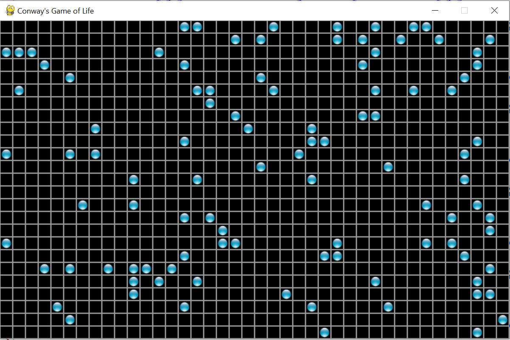

# Assignment 4

## Problems

1. ### Modify the MVC application begun in the screencasts as follows:

    a. Add code to handle the retrieve action. It should prompt the user 
    for the uid of the quote to retrieve, and then display it.

    b. Add code to handle the delete action. It should prompt the user 
    for the uid of the quote to delete, and then delete it.

    c. Add code to handle the update action. It should prompt the user 
    for the uid of the quote to update, display the quote, prompt the 
    user to enter the modified version and save the modified version. 
    (Which will need a new uid).

    (We will work on the search action later in the course.)

    Be sure to make each modification in the appropriate file so the 
    project remains an MVC application.

2. ### Animated bouncing

    Write a program that uses PyGame to simulate two balls moving around 
    an onscreen window and bouncing off the walls, and off each other. 
    Can you generalize this program so that the number of balls is input 
    by the user?

    Tip: Normally we'll want the balls to begin in random positions with 
    random velocities, but that could mean waiting a while for a 
    collision between balls, and a very long time to see each possible 
    collision. To enable easy testing you should offer an option to 
    start the balls with predetermined positions and velocities chosen 
    to cause an early collision.

3. ### Persistent Life

    Modify a life program (yours or mine) so that it displays the life 
    universe in a pygame window instead of to the Python Shell. A sample 
    state of the universe might look like this:

    

    Tip: The 16x16 cell image is .

    Implement this first by redrawing the whole universe each time. Is 
    this faster or slower than output to the shell terminal? By how much?

    One big advantage of bitmapped output is that we can output to any 
    location we wish on the screen, i.e. we don't have to always go 
    downward line by line as we display. One option this creates is to 
    change the state of cells as they are born or die instead of waiting 
    to get to the end of the loop and then redrawing the whole universe. 
    Implement this approach. Is it slower or faster than drawing the 
    whole universe at once? By how much?

    Include your answers and discussion in a comment block at the top of 
    the program describing its version history (see e.g. the minimal 
    version history in [life_v3.py](../03.3_CGoL_2_Persistence/life_v3.py)).

## Logistics

-   Since it is a single-file application Problem 2 can use our 
    usual naming scheme for program files: 
    `a`assignment#`p`problem#name`.py`. So Bob's solution to problem 2 
    on this assignment will be named `a4p2bob.py`. For Problem 1 you can 
    use the names MVC_Model_name.py and MVC_Controller_name.py where 
    name is your name and keep using the model file test_model. For 
    problem 3 use `v1` and `v2` for the two versions.