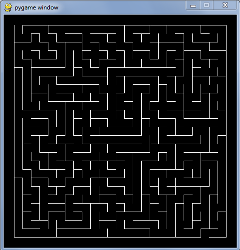

# Assignment 6

## Problems

1. Complete the development of the ObjectServer code begun in the notes 
by adding the code necessary to implement Update operations. You will 
find comments in each of the modules indicating where your additions 
should go (nice eh?).

2. Design a new object class that can be created, stored in, updated in, 
and deleted from the Object Server (formerly Quote Server) developed in 
this module.

3. Implement the Maze.carve method by translating the pseudocode in 
[maze_3.py](../06.2_Mazes_1/maze_3.py) into working Python code.

4. Implement the Maze.display method in [maze_3.py](../06.2_Mazes_1/maze_3.py) 
to produce a pygame display similar to the sample below:

## Logistics

-   Use the following naming scheme for program files: 
    `a`assignment#`p`problem#name`.py` . So Bob's solution to problem 2 
    on this assignment will be named `a6p2bob.py`.