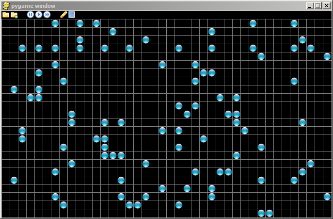

# Assignment 7

## Problems

1.  Complete the `quicksort_v1` function. Ensure that it will work on
    all lists and be sure to include your tests in the code you submit.

2.  Complete the `heapsort` function. Ensure that it will work on all
    lists and be sure to include your tests in the code you submit. 
    Please submit a graph comparing the speed of `quicksort_v1`, 
    `quicksort_v2` and `heapsort` and comment on the results.

3.  When we were creating our Heapsort we found a way to store a binary
    tree inside a list. Using that code as a building block write the
    following functions:

    -   `is_child(index1, index2)` returns True if `index2` is a child
        of `index1`.

    -   `is_descendant(index1, index2)` returns True if `index2` is a
        descendant of `index1` and does not use recursion.

    -   `is_descendant_r(index1, index2)` returns True if `index2` is a
        descendant of `index1` using recursion.

    -   `is_ancestor_r(index1, index2)` returns True if `index2` is an
        ancestor of `index1` using recursion.

4.  Activate the controls in the diagram below so they work as described
    in the notes. You may use `life_gui6.py` as a starting point if you
    wish.

    

## Logistics

-   Use the following naming scheme for program files: 
    `a`assignment#`p`problem#name`.py` . So Bob's solution to problem 2 
    on this assignment will be named `a7p2bob.py`.

