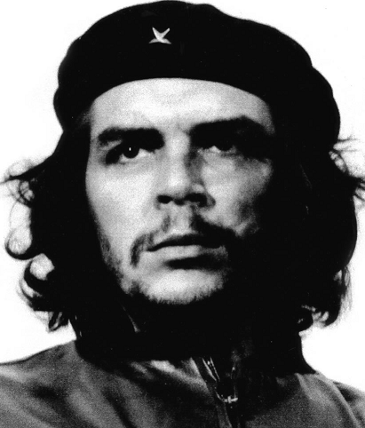
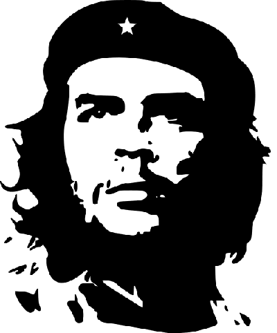
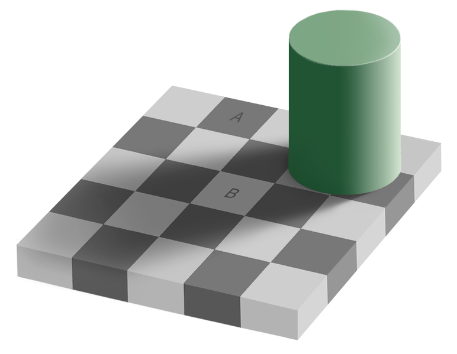

# Assignment 10

## Problems

1.  (*20 marks*) Design a new object class that can be created, stored
    in, updated in, and/or deleted from the Object Server (formerly
    Quote Server) developed in this module. I recommend using either
    `quote.py` or `hockey_player.py` as a base and modifying to suit
    your objects’ needs. You can find links to our final versions of
    the files at the bottom of the [Summary
    page](../10.1_HTTP_REST/22_Summary.md). You will also need to make
    two small additions to `object_server.py` to inform it of your new
    class’ existence. Place all the files necessary into a directory
    (or small hierarchy if you prefer) and zip it all up so you can
    submit a single file: `a10p1.zip`.

2.  (*10 marks*) **Thresholding**. Consider the two images of the Che
    Guevara below. The one on the left is an actual photograph. The one
    on the right is a manipulated image that has become iconic (even
    more so when it has a red background).

     

    In image processing terms the one on the right is a thresholded
    version of the one on the left where values above some threshold
    have been set to white (255 in pillow terms) and values below that
    threshold have been set to black (0). Thresholding is a common
    operation that can be used to highlight or emphasize some parts of
    an image, e.g. a tumour in a medical image. The question is how to
    choose the threshold value. For this problem you will write three
    thresholding functions.

    -   The first, `mean_threshold(im)`, will use the average pixel
        value in the image as the threshold. So it will set all pixels
        darker than the average pixel to be black, and all those
        brighter than average to be white. (You should write your own
        code to find the average pixel value.)

    -   The second, `median_threshold(im)`, will use the median pixel
        value in the image as the threshold. So it will set the lighter
        half of the pixels to be white and the darker half of the pixels
        to be black. (You should write your own code the find the median
        value.)

        (Note: If the pixel distribution is flat, or symmetric,
        `mean_threshold` and `median_threshold` will look the same, but
        if the distribution of pixel values is skewed, e.g. there are a
        lot more bright ones than dark ones, the results will be quite
        different.)

    -   The third, `threshold(im, value)`, thresholds the image using
        the `value` it is passed. Can you find a value that reproduces
        the image on the right above? (To make it easier to play around
        with this you can use the command `im.show()` in your program.
        This will open `im` in the default program your operating system
        uses for images of that type. If you put this in a loop that
        prompts for the threshold value and then displays the
        thresholded image you can make this thresholding into an
        interactive process).

3.  (*10 marks*) **Improving edge measurement**. In the notes we saw two
    masks that could be used to calculate vertical (`dx`) and horizontal
    (`dy`) edge strengths. But what about edges in other orientations?
    For example a diagonal edge will have medium values for both
    horizontal and vertical measures even if it is a strong edge.

    a\) To better measure edge strength we should combine the horizontal
    and vertical values to get a single measure of edge strength. The
    key to doing this is to realize that `dx` and `dy` measure
    components of edge strength. The problem of finding the ’true’
    edge strength from them is the same as the problem of finding the
    magnitude of a vector in physics from its horizontal and vertical
    components, and the solution is the same too: the magnitude is the
    root of the sum of the squares of the component magnitudes , i.e. d
    = sqrt(dx^2^ + dy^2^).

    \

    Write a function that is passed an image and returns an image whose
    pixel values are the edge strength at each location in the original
    image.

    b\) This edge strength measure is objective, but it may not be
    perceptually accurate. There is lots of evidence that the human
    visual system judges things relative to their surroundings. For a
    dramatic example consider the optical illusion below in which
    squares A and B have the same pixel value and yet do not look the
    same to us because we judge their brightness relative to their
    immediate surroundings.

    

    (For more on this illusion see [Checker shadow
    illusion](http://en.wikipedia.org/wiki/Same_color_illusion) in
    Wikipedia).

    In the same way it might be that we “see” edge strength relative to
    the surrounding brightness, i.e. a +10 jump in a dark region may be
    more significant than a +10 jump in a bright region.

    Write another function that divides the edge strength at each pixel
    location by the local average pixel value (where “local” means
    3x3 pixel “neighbourhood”).

    c\) It’s also possible that we judge edge strength relative not to
    the local luminance or pixel value, but to the local _variation_ in
    luminance. In topographic terms this explains why a 10 meter cliff
    on the prairie is more striking than a 10 m cliff in the mountains:
    there is more variation in elevation in the mountains than on the
    prairie so it stands out less in them than it does on the flat
    (nonvarying) prairie.

    How can we measure variation mathematically? One common measure for
    the variation in a set of numbers is the *root mean squared error*.
    The name actually says it all though it takes a moment or two to
    parse it. It tells us to take the square _root_ of the _mean_ of the
    _squares_ of the _errors_. The “errors” are the differences
    between each value and the average of all the values. Let’s look at
    an example:

    The numbers: 4, 5, 9, 8, 5, 4, 12, 4, 4

    The average: (4 + 5 + 9 + 8 + 5 + 4 + 11 + 4 + 4)/9 = 54/9 = 6

    The “errors”: 4-6=-2, 5-6=-1, 9-6=3, 8-6=2, 5-6=-1, 4-6=-2,
    11-6=5, 4-6=-2, 4-6=-2

    The squares of the errors: 4, 1, 9, 4, 1, 4, 25, 4, 4.

    The mean of the squared errors: (4+1+9+4+1+4+25+4+4)/9=6

    The root of the mean of the squared errors: √6=2.4494897427831779

    Write a function that divides the edge strength at each location by
    the local variation in the image, i.e. by the RMSE of the local 3x3
    neighbourhood.

## Logistics

-   Use the following naming scheme for program files: 
    `a`assignment#`p`problem#name`.py` . So Bob's solution to problem 2 
    on this assignment will be named `a10p2bob.py`
